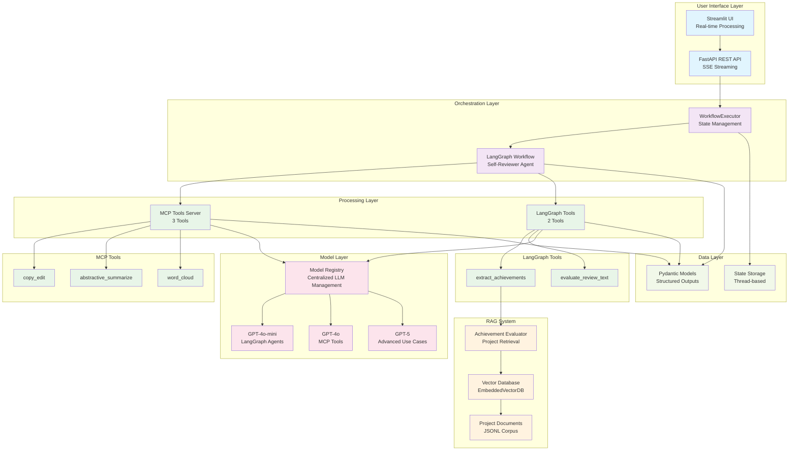

# Metamorphosis: AI-Powered Self-Review Processing System

## Overview

**Metamorphosis** is an AI-powered text processing system designed for employee self-review workflows. It leverages LangGraph orchestration, OpenAI's language models, and Model Context Protocol (MCP) integration to provide intelligent text processing capabilities including copy editing, summarization, achievement extraction, and quality evaluation.

## Core Features

### 🔄 **Multi-Stage Text Processing Pipeline**
- **Copy Editing**: Grammar, spelling, and style improvements using OpenAI GPT models
- **Summarization**: Abstractive summaries with configurable length (default 300 words)
- **Achievement Extraction**: Structured extraction of key accomplishments with impact areas using LangGraph agents
- **RAG Enhancement**: Achievement contextualization through project document retrieval and augmentation
- **Quality Evaluation**: Comprehensive writing quality assessment with radar chart visualization using LangGraph agents
- **Visualization**: Word cloud generation and evaluation radar charts

### 🤖 **AI Agent Orchestration**
- **LangGraph Workflows**: State-based multi-agent processing with self-reviewer agent
- **Direct Tool Access**: LangGraph agents directly access achievement extraction and evaluation tools (not via MCP)
- **RAG Integration**: Achievement evaluator with vector database for project document retrieval
- **Parallel Processing**: Concurrent execution of independent tasks
- **Real-time Streaming**: Live updates via Server-Sent Events (SSE)
- **State Persistence**: Thread-based conversation management

### 🛠️ **Hybrid Tool Integration**
- **MCP Tools**: Copy editing, summarization, and word cloud generation via MCP server
- **LangGraph Tools**: Achievement extraction and evaluation via direct agent tool access
- **RAG System**: Vector database integration for project document retrieval and achievement contextualization
- **Type Safety**: Pydantic models for structured outputs
- **Error Handling**: Comprehensive exception management

## Architecture

The system implements a multi-layer architecture:

- **Presentation Layer**: Streamlit UI and FastAPI REST API
- **Orchestration Layer**: LangGraph workflows with self-reviewer agent
- **Processing Layer**: Hybrid approach with MCP tools server and direct LangGraph tool access
- **RAG Layer**: Vector database and achievement evaluator for project document retrieval
- **Model Layer**: Centralized model registry managing multiple OpenAI LLMs (GPT-4o-mini for agents, GPT-4o for MCP tools, GPT-5 for advanced use cases)
- **Data Layer**: Pydantic models and structured outputs

### The Processing Tools

The system provides a hybrid approach to text processing:

**MCP Tools (3 tools):**
1. **`copy_edit`**: Grammar and style improvements while preserving original voice
2. **`abstractive_summarize`**: Intelligent summarization with configurable word limits
3. **`word_cloud`**: Visual word cloud generation from text content

**LangGraph Tools (2 tools):**

4. **`extract_achievements`**: Structured extraction of key accomplishments with impact categorization
5. **`evaluate_review_text`**: Comprehensive quality assessment with scoring metrics

**RAG Enhancement:**
- **Achievement Contextualization**: Extracted achievements are enhanced through Retrieval-Augmented Generation (RAG) by accessing relevant project documents to add contextual details and validate impact claims

### User Interface

The system provides a Streamlit-based web interface with:
- Real-time text processing with live updates
- Interactive controls for workflow execution
- Debug information and event inspection
- Session state management for conversation persistence


## Implementation Status

✅ **Completed Features**
- LangGraph-based workflow orchestration with self-reviewer agent
- Hybrid tool architecture: MCP server (3 tools) + LangGraph direct tools (2 tools)
- RAG system for achievement contextualization using project documents
- Streamlit UI with real-time streaming capabilities
- FastAPI REST API with SSE support
- Comprehensive Pydantic data models
- OpenAI GPT model integration with centralized registry (GPT-4o-mini for agents, GPT-4o for MCP tools, GPT-5 for advanced use cases)
- Word cloud and radar chart visualization
- Achievement extraction with impact categorization and RAG enhancement
- Quality evaluation with scoring metrics

✅ **Architecture Documentation**
- Complete system architecture diagrams
- Component relationship documentation
- API documentation with Swagger/ReDoc
- Comprehensive code documentation

## Technical Implementation

The system is built using Python frameworks and design patterns:

**Core Technologies:**
- **LangGraph**: Multi-agent workflow orchestration with direct tool access
- **FastMCP**: Model Context Protocol server implementation (3 tools)
- **RAG System**: Vector database and retrieval for achievement contextualization
- **Streamlit**: Interactive web interface
- **FastAPI**: High-performance REST API
- **Pydantic**: Type-safe data validation
- **OpenAI GPT**: Language model integration (GPT-4o-mini for agents, GPT-4o for MCP tools, GPT-5 for advanced use cases)

**Key Design Principles:**
- **Design-by-Contract**: Pre/post-condition validation with icontract
- **Low Cognitive Complexity**: Functions limited to CC ≤ 10
- **Type Safety**: Comprehensive type annotations throughout
- **Error Handling**: Structured exception management
- **Modular Architecture**: Clean separation of concerns

## System Architecture



## Getting Started

Follow these steps to run the **Employee Self-Review Wizard** application:

### 1. Environment Setup
First, update the environment configuration by copying the example file and updating relevant variables:
```bash
cp .env.example .env
# Edit .env with your specific configuration values
```

### 2. Install Dependencies
Create the virtual environment and install all dependencies:
```bash
uv sync
```

### 3. Start the MCP Tools Server
Run the MCP tools server to provide the core functionality:
```bash
uv run ./src/metamorphosis/mcp/tools_server.py
```

### 4. Start the Agent Service
In a separate terminal, run the FastAPI service that hosts the LangGraph agents:
```bash
uv run ./src/metamorphosis/agents/agent_service.py
```

### 5. Launch the User Interface
Finally, start the Streamlit UI in another terminal:
```bash
streamlit run ./src/metamorphosis/ui/streamlit_ui.py
```

Once all services are running, you can access the application through the Streamlit interface in your web browser.