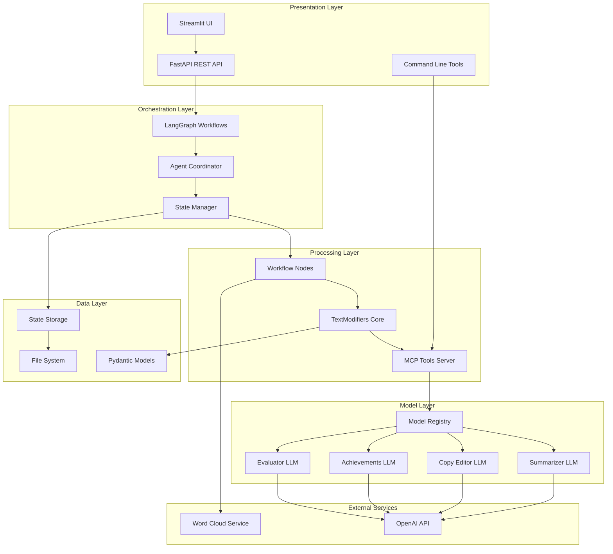
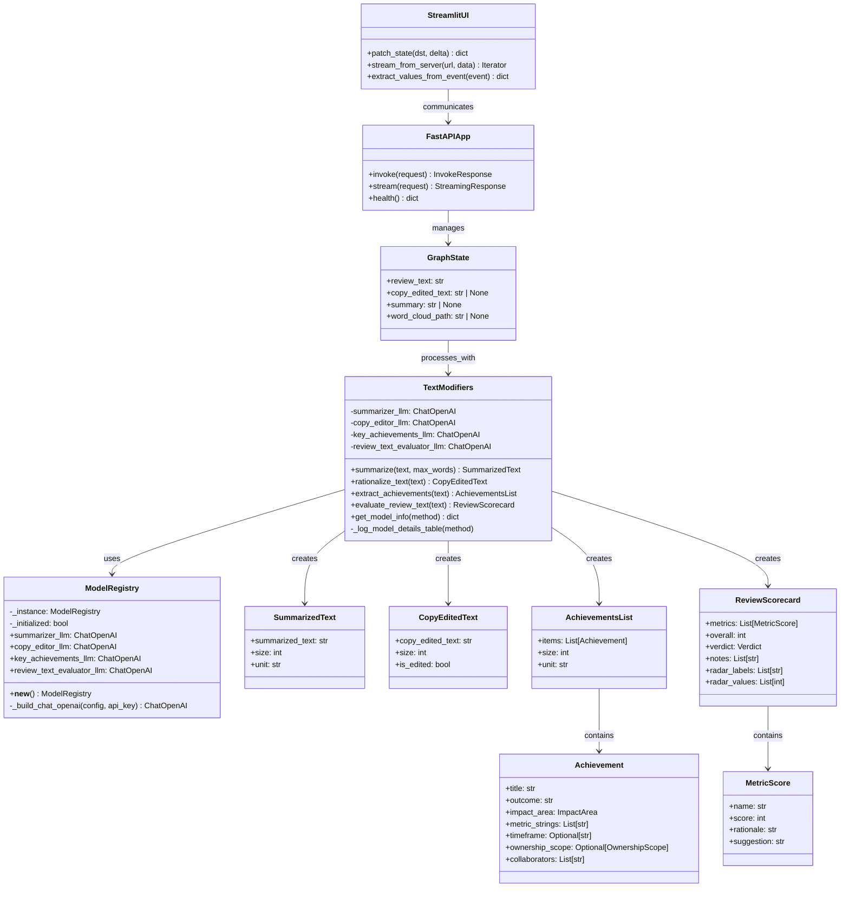
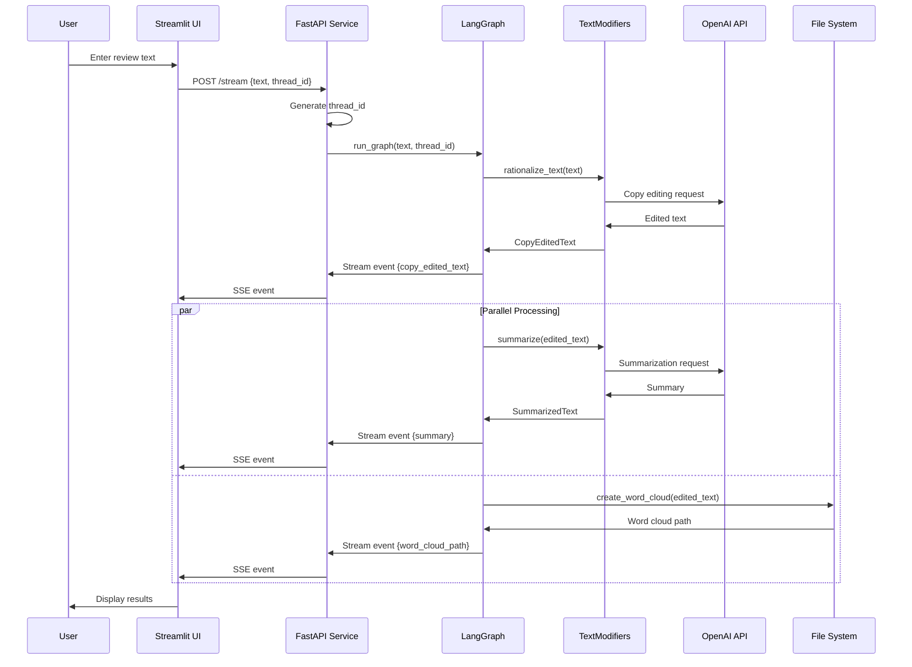
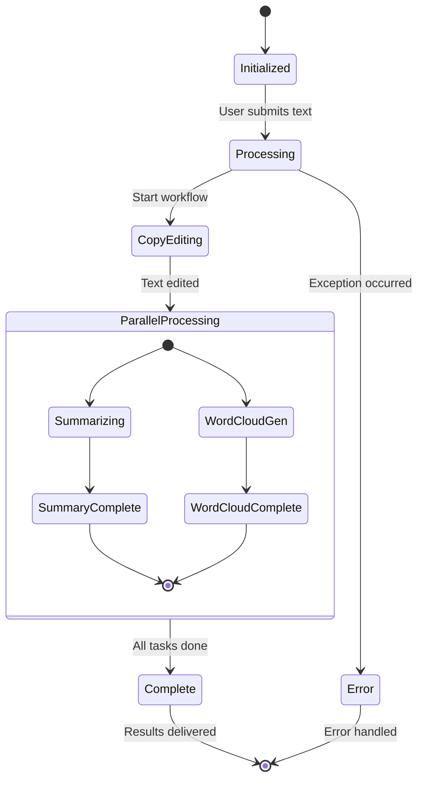
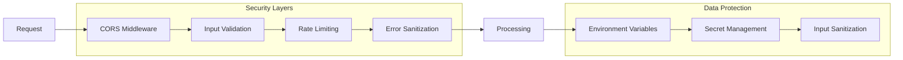
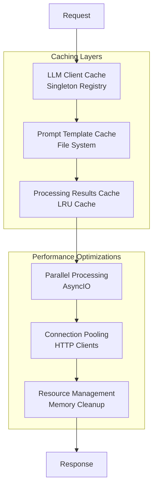
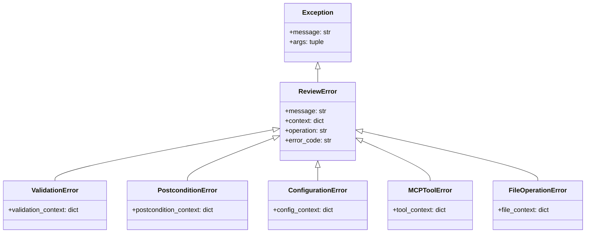
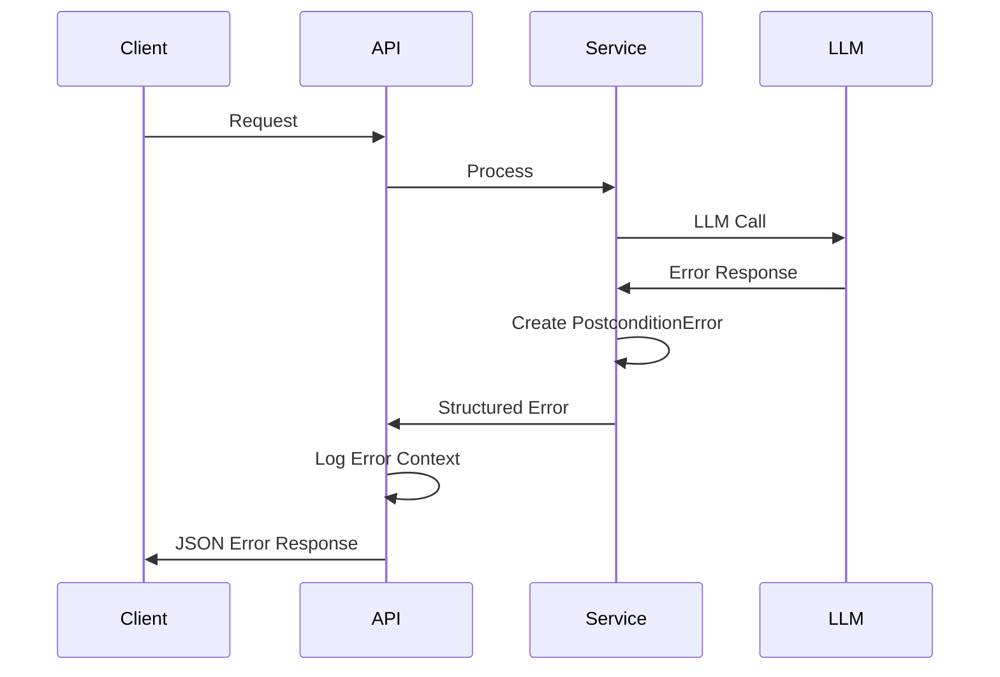
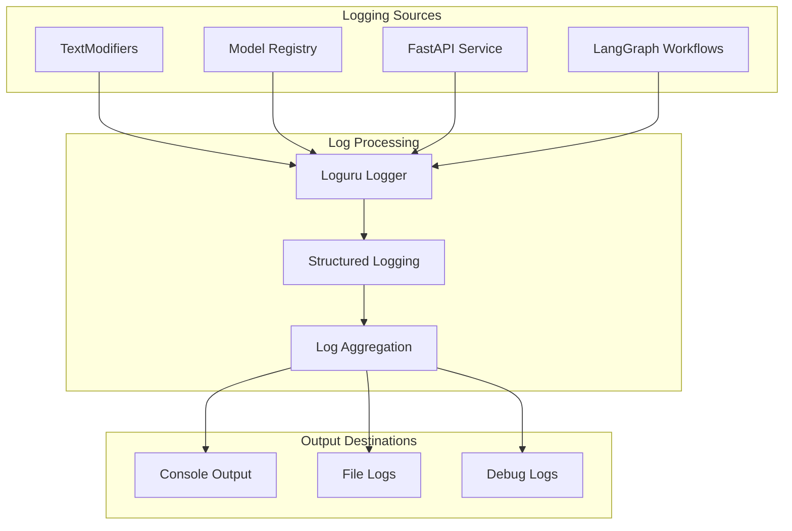
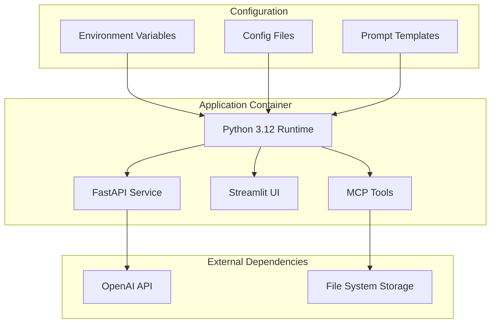

# System Architecture

## Overview

The Metamorphosis system implements a sophisticated AI-powered text processing architecture using modern Python frameworks and design patterns. This document provides a comprehensive view of the system's architecture, component relationships, and data flow.

## High-Level Architecture



## Component Architecture

### Core Classes and Relationships



## Data Flow Architecture

### Processing Pipeline



### State Management Flow



## Design Patterns

### Singleton Pattern (Model Registry)

```python
class ModelRegistry:
    _instance = None
    _initialized = False
    
    def __new__(cls):
        if cls._instance is None:
            cls._instance = super().__new__(cls)
        return cls._instance
    
    def __init__(self):
        if not self._initialized:
            # Initialize LLM clients
            self._initialize_llms()
            self._initialized = True
```

### Factory Pattern (Configuration Loading)

```python
def get_model_registry() -> ModelRegistry:
    """Factory function for ModelRegistry singleton."""
    return ModelRegistry()

def _load_config() -> dict[str, Any]:
    """Factory for configuration loading with fallbacks."""
    # Configuration loading logic
    return config_data
```

### Strategy Pattern (Text Processing)

```python
class TextModifiers:
    def __init__(self):
        # Different strategies for different processing types
        self.strategies = {
            'summarize': self._create_summarizer_chain(),
            'copy_edit': self._create_copy_editor_chain(),
            'extract_achievements': self._create_achievements_chain(),
            'evaluate': self._create_evaluator_chain()
        }
```

### Observer Pattern (Streaming Events)

```python
async def _generate_stream_events(review_text: str, thread_id: str):
    """Observer pattern for streaming workflow events."""
    async for event in run_graph(graph, review_text, thread_id):
        # Notify observers (UI clients) of state changes
        yield f"data: {json.dumps(event)}\n\n".encode("utf-8")
```

### Decorator Pattern (Validation)

```python
@validate_call
def summarize(
    self,
    *,
    text: Annotated[str, Field(min_length=1)],
    max_words: Annotated[int, Field(gt=0)] = 300,
) -> SummarizedText:
    # Method implementation with automatic validation
```

## Security Architecture

### API Security



### Configuration Security

- **API Key Management**: Environment variable isolation
- **Input Validation**: Pydantic model validation
- **Error Handling**: Sanitized error responses
- **CORS Configuration**: Restricted origins in production

## Performance Architecture

### Caching Strategy



### Scalability Considerations

- **Horizontal Scaling**: Stateless service design
- **Load Balancing**: Multiple service instances
- **Resource Optimization**: Efficient memory usage
- **Connection Management**: HTTP connection pooling

## Error Handling Architecture

### Exception Hierarchy



### Error Flow



## Monitoring and Observability

### Logging Architecture



### Metrics Collection

- **Processing Metrics**: Token usage, processing time
- **Error Metrics**: Error rates, failure patterns  
- **Performance Metrics**: Response times, throughput
- **Resource Metrics**: Memory usage, CPU utilization

## Deployment Architecture

### Container Architecture



### Service Dependencies

- **Runtime**: Python 3.12+
- **Core Dependencies**: FastAPI, LangChain, Pydantic, Streamlit
- **AI Services**: OpenAI API
- **Utilities**: Rich, Plotly, Loguru
- **Development**: Ruff, Pytest, Radon

## Future Architecture Considerations

### Extensibility Points

1. **New Processing Types**: Additional text processing capabilities
2. **Multiple LLM Providers**: Support for different AI services
3. **Enhanced Workflows**: More complex multi-agent workflows
4. **Real-time Processing**: WebSocket-based real-time updates
5. **Batch Processing**: Large-scale document processing

### Scalability Enhancements

1. **Microservices**: Split into smaller, focused services
2. **Message Queues**: Asynchronous processing with queues
3. **Caching Layer**: Redis or similar for distributed caching
4. **Database Integration**: Persistent storage for results
5. **Load Balancing**: Multiple service instances

---

*This architecture documentation is maintained in sync with the system implementation and updated as the system evolves.*
