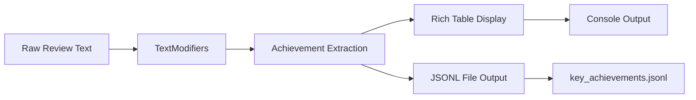

# Achievement Extraction Usage Example

::: examples.extract_achievements_usage

## Overview

The `extract_achievements_usage.py` script demonstrates the powerful achievement extraction capabilities of the Metamorphosis system. It showcases how to extract, rank, and display structured accomplishments from employee self-review text using advanced LLM processing.

## Features

### Core Functionality

- **Structured Achievement Extraction**: Identifies up to 10 key accomplishments
- **Rich Metadata**: Impact areas, metrics, timeframes, and collaborators
- **Ranking Algorithm**: Achievements ranked by business impact and quality
- **Professional Display**: Beautiful rich table formatting with color coding
- **Data Persistence**: JSONL output for further processing and analysis

### Visual Output



## Usage

### Basic Execution

Run from the project root directory:

```bash
# Using Python directly
python -m src.examples.extract_achievements_usage

# Using uv (recommended)
uv run python -m src.examples.extract_achievements_usage
```

### Expected Output

The script produces rich console output with:

1. **Processing Status**: Real-time feedback on extraction progress
2. **Achievement Table**: Formatted display of extracted accomplishments
3. **Summary Panel**: Overview of results and integration notes
4. **File Output**: JSONL file creation confirmation

## Code Structure

### Main Processing Flow

```python
def main() -> None:
    """Main execution function with comprehensive error handling."""
    console = Console()
    
    try:
        # 1. Load sample review text
        review_text = load_sample_review()
        
        # 2. Initialize text processor
        modifier = TextModifiers()
        
        # 3. Extract achievements
        achievements = modifier.extract_achievements(text=review_text)
        
        # 4. Display results
        display_results(console, achievements)
        
        # 5. Save to JSONL
        save_to_jsonl(achievements)
        
    except Exception as e:
        handle_error(console, e)
```

### Key Functions

#### Achievement Table Creation

```python
def create_achievements_table(achievements_list: AchievementsList) -> Table:
    """Create a rich table displaying extracted achievements."""
    table = Table(
        title=(
            f"🏆 Extracted Key Achievements "
            f"({len(achievements_list.items)} items, ~{achievements_list.size} tokens)"
        ),
        box=box.ROUNDED,
        show_header=True,
        header_style="bold magenta"
    )
    
    # Add columns with appropriate styling
    table.add_column("Title", style="bold cyan", width=25)
    table.add_column("Outcome", style="white", width=40)
    table.add_column("Impact", style="green", width=15)
    table.add_column("Metrics", style="yellow", width=20)
    table.add_column("Timeline", style="blue", width=12)
    
    # Populate table rows
    for i, achievement in enumerate(achievements_list.items, 1):
        table.add_row(
            f"{i}. {achievement.title}",
            achievement.outcome,
            format_impact_area(achievement.impact_area),
            format_metrics(achievement.metric_strings),
            achievement.timeframe or "Not specified"
        )
    
    return table
```

#### JSONL Output

```python
def write_achievements_to_jsonl(
    achievements_list: AchievementsList, 
    output_path: Path
) -> None:
    """Write achievements to JSONL format for further processing."""
    output_path.parent.mkdir(parents=True, exist_ok=True)
    
    with output_path.open("w", encoding="utf-8") as f:
        achievements_dict = achievements_list.model_dump()
        f.write(json.dumps(achievements_dict, ensure_ascii=False) + "\n")
    
    logger.debug(f"Achievements written to {output_path}")
```

## Sample Input

The script uses a sample employee review from `sample_reviews/copy_edited.md`:

```markdown
I had an eventful cycle this summer. Learnt agentic workflows and 
implemented a self-reviewer agent process. It significantly improved 
employee productivity for the organization.

Key accomplishments include:
- Reduced review processing time by 60%
- Implemented automated quality checks
- Collaborated with HR and Engineering teams
- Delivered training to 50+ employees
```

## Sample Output

### Console Display

The script produces a beautifully formatted table:

```
🏆 Extracted Key Achievements (3 items, ~145 tokens)
┌─────────────────────────────┬──────────────────────────────────────┬─────────────────┬──────────────────────┬──────────────┐
│ Title                       │ Outcome                              │ Impact          │ Metrics              │ Timeline     │
├─────────────────────────────┼──────────────────────────────────────┼─────────────────┼──────────────────────┼──────────────┤
│ 1. Implemented self-reviewer│ Delivered automated agent process   │ 🚀 Innovation   │ 60%                  │ Summer 2025  │
│    agent process           │ that improved productivity           │                 │                      │              │
├─────────────────────────────┼──────────────────────────────────────┼─────────────────┼──────────────────────┼──────────────┤
│ 2. Reduced review processing│ Achieved 60% reduction in processing│ ⚡ Performance  │ 60%, 50+             │ Not specified│
│    time                    │ time through automation              │                 │                      │              │
├─────────────────────────────┼──────────────────────────────────────┼─────────────────┼──────────────────────┼──────────────┤
│ 3. Delivered employee       │ Trained 50+ employees on new        │ 👥 Productivity │ 50+                  │ Not specified│
│    training program        │ workflow processes                   │                 │                      │              │
└─────────────────────────────┴──────────────────────────────────────┴─────────────────┴──────────────────────┴──────────────┘
```

### JSONL Output

The generated `key_achievements.jsonl` file contains:

```json
{
  "items": [
    {
      "title": "Implemented self-reviewer agent process",
      "outcome": "Delivered automated agent process that improved productivity",
      "impact_area": "innovation",
      "metric_strings": ["60%"],
      "timeframe": "Summer 2025",
      "ownership_scope": "TechLead",
      "collaborators": ["HR team", "Engineering teams"]
    }
  ],
  "size": 145,
  "unit": "tokens"
}
```

## Advanced Features

### Impact Area Classification

Achievements are automatically classified into impact areas:

- **🔧 Reliability**: System stability and uptime improvements
- **⚡ Performance**: Speed and efficiency optimizations
- **🔒 Security**: Security enhancements and compliance
- **💰 Cost Efficiency**: Resource optimization and savings
- **👤 User Experience**: User-facing improvements
- **👥 Productivity**: Developer and team productivity gains
- **📈 Scalability**: System scaling and capacity improvements
- **🚀 Innovation**: New technologies and methodologies
- **📋 Compliance**: Regulatory and policy adherence
- **⚙️ Operations**: Operational excellence improvements
- **📊 Business Growth**: Revenue and business impact
- **🔨 Technical Debt**: Code quality and maintenance

### Metric Extraction

The system extracts quantitative metrics directly from the text:

```python
# Examples of extracted metrics
achievement.metric_strings = [
    "60%",           # Percentage improvements
    "480ms",         # Latency measurements  
    "50+",           # Quantity indicators
    "$100K",         # Cost savings
    "99.9%",         # Availability metrics
    "10x"            # Multiplier improvements
]
```

### Collaboration Tracking

Identifies and tracks collaboration patterns:

```python
achievement.collaborators = [
    "HR team",
    "Engineering teams", 
    "Product Management",
    "Data Science team"
]
```

### Timeframe Detection

Automatically detects and extracts timeframes:

```python
achievement.timeframe = "H1 2025"  # Half-year periods
achievement.timeframe = "Q3"       # Quarter periods  
achievement.timeframe = "Summer"   # Seasonal periods
achievement.timeframe = "2024"     # Annual periods
```

## Customization

### Input Modification

To use different input text:

```python
# Option 1: Modify the review file
# Edit sample_reviews/copy_edited.md

# Option 2: Use different file
review_file = project_root / "sample_reviews" / "your_review.md"

# Option 3: Use inline text
review_text = """
Your custom employee review text here...
"""
```

### Output Customization

Modify the table display:

```python
# Add custom columns
table.add_column("Custom Field", style="cyan")

# Change color scheme
table = Table(
    title="Custom Title",
    box=box.SIMPLE,  # Different box style
    header_style="bold green"  # Different header color
)

# Custom row formatting
for achievement in achievements.items:
    custom_value = process_achievement(achievement)
    table.add_row(
        achievement.title,
        achievement.outcome,
        custom_value  # Your custom processing
    )
```

### Processing Parameters

The extraction can be customized through prompt modification:

```python
# Modify prompts/key_achievements_system_prompt.md to:
# - Change ranking criteria
# - Adjust output format
# - Modify quality thresholds
# - Add custom instructions
```

## Error Handling

### Comprehensive Error Management

```python
try:
    achievements = modifier.extract_achievements(text=review_text)
except ValidationError as e:
    console.print(f"❌ Input validation failed: {e}", style="bold red")
except PostconditionError as e:
    console.print(f"❌ Processing failed: {e}", style="bold red")
except FileNotFoundError as e:
    console.print(f"❌ Sample file not found: {e}", style="bold red")
except Exception as e:
    console.print(f"❌ Unexpected error: {e}", style="bold red")
    logger.exception("Unexpected error in main execution")
```

### Graceful Degradation

The script handles various edge cases:

- **Empty input text**: Provides helpful error message
- **No achievements found**: Displays appropriate message
- **File access issues**: Suggests alternative approaches
- **API failures**: Provides debugging information

## Performance Considerations

### Token Usage

- **Typical usage**: 100-500 tokens per review
- **Large reviews**: May use 1000+ tokens
- **Cost estimation**: Monitor OpenAI API usage

### Processing Time

- **Simple reviews**: 2-5 seconds
- **Complex reviews**: 5-15 seconds
- **Network dependent**: API latency affects total time

### Memory Usage

- **Lightweight**: Minimal memory footprint
- **Scalable**: Can process multiple reviews sequentially
- **Efficient**: Proper cleanup of temporary objects

## Integration Examples

### Batch Processing

```python
def process_multiple_reviews():
    modifier = TextModifiers()
    results = []
    
    for review_file in review_files:
        try:
            text = load_review(review_file)
            achievements = modifier.extract_achievements(text=text)
            results.append({
                'file': review_file,
                'achievements': achievements
            })
        except Exception as e:
            logger.error(f"Failed to process {review_file}: {e}")
    
    return results
```

### API Integration

```python
from fastapi import FastAPI
from metamorphosis.mcp.text_modifiers import TextModifiers

app = FastAPI()
modifier = TextModifiers()

@app.post("/extract-achievements")
async def extract_achievements(request: dict):
    try:
        achievements = modifier.extract_achievements(
            text=request["review_text"]
        )
        return achievements.model_dump()
    except Exception as e:
        return {"error": str(e)}
```

### Data Pipeline Integration

```python
def create_achievement_pipeline():
    """Create a data processing pipeline."""
    modifier = TextModifiers()
    
    def process_review(review_text: str) -> dict:
        achievements = modifier.extract_achievements(text=review_text)
        return {
            'achievements_count': len(achievements.items),
            'total_tokens': achievements.size,
            'top_impact_area': get_top_impact_area(achievements),
            'data': achievements.model_dump()
        }
    
    return process_review
```

## Testing

### Unit Tests

```python
import pytest
from examples.extract_achievements_usage import (
    create_achievements_table,
    write_achievements_to_jsonl
)

def test_table_creation():
    # Create mock achievements
    achievements = create_mock_achievements()
    
    # Test table creation
    table = create_achievements_table(achievements)
    assert table.title
    assert len(table.columns) == 5

def test_jsonl_output(tmp_path):
    achievements = create_mock_achievements()
    output_file = tmp_path / "test_output.jsonl"
    
    write_achievements_to_jsonl(achievements, output_file)
    
    assert output_file.exists()
    # Verify content is valid JSON
    import json
    with output_file.open() as f:
        data = json.load(f)
        assert "items" in data
```

### Integration Tests

```python
def test_full_extraction_pipeline():
    """Test the complete extraction process."""
    from examples.extract_achievements_usage import main
    
    # Mock the input and run the main function
    # Verify output files are created
    # Check console output formatting
```

## Troubleshooting

### Common Issues

1. **No achievements extracted**:
   - Review text may be too vague or activity-focused
   - Try text with more concrete outcomes and metrics
   - Check the prompt templates for guidance

2. **Low-quality extractions**:
   - Input text lacks specific details
   - Missing quantitative information
   - No clear impact statements

3. **API errors**:
   - Verify OpenAI API key is valid
   - Check rate limits and quotas
   - Monitor network connectivity

### Debug Mode

Enable detailed logging:

```python
import logging
from loguru import logger

# Add debug logging
logger.add("achievement_debug.log", level="DEBUG")
logging.basicConfig(level=logging.DEBUG)

# Run the script - all operations will be logged
```

## See Also

- [TextModifiers Class](../metamorphosis/mcp/TextModifiers.md) - Core achievement extraction implementation
- [Data Models](../metamorphosis/datamodel.md) - Achievement and AchievementsList schemas
- [Other Examples](index.md) - Additional usage examples
- [MCP Package](../metamorphosis/mcp/index.md) - Text processing architecture

---

*This documentation is automatically generated from the source code and maintained in sync with the implementation.*
