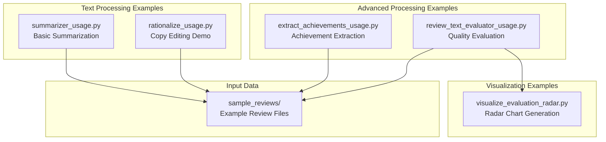

# Examples Directory

The `examples/` directory contains comprehensive usage examples and demonstrations of the Metamorphosis text processing capabilities. Each example is a standalone script that showcases specific features with detailed explanations and rich output formatting.

## Overview



## Example Scripts

### Basic Text Processing

| Script | Purpose | Features | Output |
|--------|---------|----------|--------|
| [`summarizer_usage.py`](summarizer_usage.md) | Text summarization demo | Configurable word limits, rich formatting | Console display + JSONL |
| [`rationalize_usage.py`](rationalize_usage.md) | Copy editing showcase | Before/after comparison, change tracking | Rich table output |

### Advanced Processing

| Script | Purpose | Features | Output |
|--------|---------|----------|--------|
| [`extract_achievements_usage.py`](extract_achievements_usage.md) | Achievement extraction | Structured metadata, ranking | Rich table + JSONL |
| [`review_text_evaluator_usage.py`](review_text_evaluator_usage.md) | Quality assessment | 6-dimension scoring, suggestions | Rich table + JSONL |

### Visualization

| Script | Purpose | Features | Output |
|--------|---------|----------|--------|
| [`visualize_evaluation_radar.py`](visualize_evaluation_radar.md) | Radar chart creation | Interactive plots, goal references | HTML file + console |

## Common Features

### Rich Console Output

All examples use the `rich` library for beautiful console formatting:

- **Color-coded output**: Different colors for different types of information
- **Progress indicators**: Visual feedback during processing
- **Structured tables**: Organized display of results
- **Panel formatting**: Highlighted sections and tips

### Error Handling

Comprehensive error handling with user-friendly messages:

```python
try:
    # Processing logic
    result = modifier.process_text(text=review_text)
except ValidationError as e:
    console.print(f"❌ Validation Error: {e}", style="bold red")
except PostconditionError as e:
    console.print(f"❌ Processing Error: {e}", style="bold red")
except Exception as e:
    console.print(f"❌ Unexpected Error: {e}", style="bold red")
```

### Data Persistence

Examples demonstrate both console output and data persistence:

- **JSONL files**: Structured data for further processing
- **HTML files**: Interactive visualizations
- **Logging**: Detailed operation tracking

## Usage Patterns

### Running Examples

All examples can be run from the project root using Python's module syntax:

```bash
# Basic usage
python -m src.examples.summarizer_usage
python -m src.examples.rationalize_usage

# Advanced features
python -m src.examples.extract_achievements_usage
python -m src.examples.review_text_evaluator_usage

# Visualization
python -m src.examples.visualize_evaluation_radar
```

### Using with uv

For consistent dependency management:

```bash
uv run python -m src.examples.summarizer_usage
uv run python -m src.examples.extract_achievements_usage
```

### Custom Input

Examples can be modified to use custom input:

```python
# Modify the review_text variable in any example
review_text = """
Your custom employee review text here...
"""
```

## Integration Examples

### Basic Integration

```python
from metamorphosis.mcp.text_modifiers import TextModifiers
from rich.console import Console

def simple_processing_example():
    console = Console()
    modifier = TextModifiers()
    
    # Process text
    result = modifier.summarize(
        text="Your review text...",
        max_words=100
    )
    
    # Display result
    console.print(f"Summary: {result.summarized_text}")
```

### Batch Processing

```python
def batch_processing_example():
    modifier = TextModifiers()
    reviews = load_multiple_reviews()
    
    results = []
    for review in reviews:
        try:
            result = modifier.extract_achievements(text=review)
            results.append(result)
        except Exception as e:
            print(f"Error processing review: {e}")
    
    return results
```

### Pipeline Integration

```python
def full_pipeline_example():
    modifier = TextModifiers()
    review_text = load_review()
    
    # Step 1: Copy edit
    edited = modifier.rationalize_text(text=review_text)
    
    # Step 2: Extract achievements
    achievements = modifier.extract_achievements(text=edited.copy_edited_text)
    
    # Step 3: Evaluate quality
    evaluation = modifier.evaluate_review_text(text=edited.copy_edited_text)
    
    # Step 4: Summarize
    summary = modifier.summarize(text=edited.copy_edited_text, max_words=100)
    
    return {
        "edited": edited,
        "achievements": achievements,
        "evaluation": evaluation,
        "summary": summary
    }
```

## Sample Data

### Review Files

The `sample_reviews/` directory contains example employee review files:

- **`raw_review.md`**: Original, unedited review text
- **`copy_edited.md`**: Professionally edited version
- **`data_engineer_review.md`**: Technical role-specific example

### Generated Outputs

Examples generate various output files:

- **`key_achievements.jsonl`**: Extracted achievements data
- **`text_evaluator_results.jsonl`**: Quality evaluation results
- **`evaluation_radar_plot.html`**: Interactive visualization

## Customization Guide

### Adding New Examples

To create a new example script:

1. **Create the script file**:
   ```python
   # src/examples/my_custom_example.py
   from metamorphosis.mcp.text_modifiers import TextModifiers
   from rich.console import Console
   
   def main():
       console = Console()
       modifier = TextModifiers()
       
       # Your custom logic here
       
   if __name__ == "__main__":
       main()
   ```

2. **Add file header**:
   ```python
   # =============================================================================
   #  Filename: my_custom_example.py
   #
   #  Short Description: Custom example demonstrating specific feature
   #
   #  Creation date: YYYY-MM-DD
   #  Author: Your Name
   # =============================================================================
   ```

3. **Follow established patterns**:
   - Use rich for output formatting
   - Include comprehensive error handling
   - Provide clear documentation
   - Save results to files when appropriate

### Modifying Existing Examples

Common customizations:

1. **Change input data**:
   ```python
   # Use different sample file
   review_file = project_root / "sample_reviews" / "your_review.md"
   ```

2. **Adjust processing parameters**:
   ```python
   # Different word limits for summarization
   result = modifier.summarize(text=review_text, max_words=200)
   ```

3. **Modify output format**:
   ```python
   # Add custom table columns
   table.add_column("Custom Field", style="cyan")
   ```

## Testing Examples

### Automated Testing

Examples can be tested programmatically:

```python
import subprocess
import sys

def test_example(example_name):
    """Test an example script."""
    try:
        result = subprocess.run(
            [sys.executable, "-m", f"src.examples.{example_name}"],
            capture_output=True,
            text=True,
            timeout=300
        )
        return result.returncode == 0
    except subprocess.TimeoutExpired:
        return False

# Test all examples
examples = [
    "summarizer_usage",
    "rationalize_usage",
    "extract_achievements_usage",
    "review_text_evaluator_usage",
    "visualize_evaluation_radar"
]

for example in examples:
    success = test_example(example)
    print(f"{example}: {'✅ PASS' if success else '❌ FAIL'}")
```

### Manual Testing

1. **Run each example individually**
2. **Verify console output is formatted correctly**
3. **Check generated files exist and contain valid data**
4. **Test with different input data**

## Performance Considerations

### Resource Usage

Examples are designed to be educational rather than production-optimized:

- **Token usage**: Monitor OpenAI API costs when running multiple examples
- **Memory usage**: Large review texts may consume significant memory
- **Processing time**: Complex operations may take several seconds

### Optimization Tips

For production use:

1. **Implement caching**: Reuse TextModifiers instances
2. **Batch processing**: Process multiple reviews efficiently
3. **Async processing**: Use async/await for concurrent operations
4. **Resource monitoring**: Track API usage and costs

## Troubleshooting

### Common Issues

1. **Import errors**:
   ```bash
   # Ensure PYTHONPATH is set correctly
   export PYTHONPATH="${PYTHONPATH}:$(pwd)/src"
   ```

2. **API key issues**:
   ```bash
   # Verify environment variables
   echo $OPENAI_API_KEY
   ```

3. **File not found errors**:
   ```bash
   # Run from project root directory
   cd /path/to/metamorphosis
   python -m src.examples.example_name
   ```

### Debug Mode

Enable detailed logging for troubleshooting:

```python
import logging
from loguru import logger

# Add debug logging
logger.add("debug.log", level="DEBUG")
logging.basicConfig(level=logging.DEBUG)
```

## Contributing

### Adding New Examples

When contributing new examples:

1. Follow the established code style and patterns
2. Include comprehensive documentation
3. Add error handling and user feedback
4. Test with various input scenarios
5. Update this documentation

### Improving Existing Examples

Areas for improvement:

- Enhanced error messages
- Additional output formats
- Performance optimizations
- More comprehensive examples
- Better visualization options

## See Also

- [MCP Package](../metamorphosis/mcp/index.md) - Core text processing utilities
- [Agents Package](../metamorphosis/agents/index.md) - Workflow orchestration
- [Data Models](../metamorphosis/datamodel.md) - Pydantic schemas
- [Configuration](../metamorphosis/index.md#configuration) - Setup and configuration

---

*This documentation is automatically generated and maintained in sync with the example implementations.*
