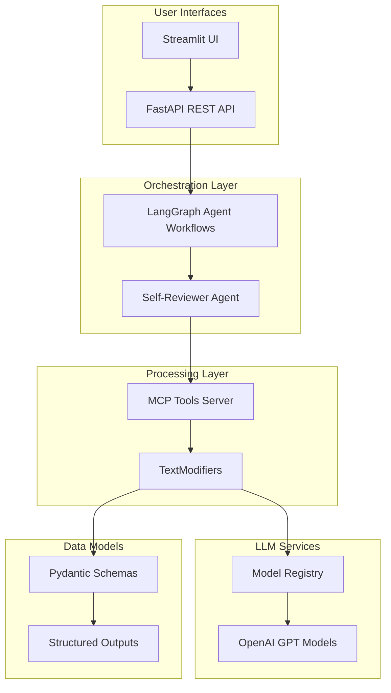

# Metamorphosis: AI-Powered Self-Review Processing System

## Overview

**Metamorphosis** is a comprehensive AI-powered text processing system designed for employee self-review workflows. It leverages LangGraph orchestration, OpenAI's language models, and Model Context Protocol (MCP) integration to provide intelligent text processing capabilities including copy editing, summarization, achievement extraction, and quality evaluation.

## Project Architecture



## Core Features

### 🔄 **Multi-Stage Text Processing Pipeline**
- **Copy Editing**: Grammar, spelling, and style improvements
- **Summarization**: Abstractive summaries with configurable length
- **Achievement Extraction**: Structured extraction of key accomplishments
- **Quality Evaluation**: Comprehensive writing quality assessment
- **Visualization**: Word cloud and radar chart generation

### 🤖 **AI Agent Orchestration**
- **LangGraph Workflows**: State-based multi-agent processing
- **Parallel Processing**: Concurrent execution of independent tasks
- **Real-time Streaming**: Live updates via Server-Sent Events
- **State Persistence**: Thread-based conversation management

### 🛠️ **MCP Integration**
- **Standardized Tools**: MCP-compliant text processing functions
- **Type Safety**: Pydantic models for structured outputs
- **Error Handling**: Comprehensive exception management
- **Caching**: LRU-cached model instances for performance

## Package Structure

The project is organized into several specialized packages:

### 📦 **Core Packages**

| Package | Description | Documentation |
|---------|-------------|---------------|
| [`metamorphosis`](metamorphosis/index.md) | Main package with configuration and utilities | [View →](metamorphosis/index.md) |
| [`metamorphosis.mcp`](metamorphosis/mcp/index.md) | MCP tools and text processing utilities | [View →](metamorphosis/mcp/index.md) |
| [`metamorphosis.agents`](metamorphosis/agents/index.md) | LangGraph workflows and FastAPI service | [View →](metamorphosis/agents/index.md) |
| [`metamorphosis.ui`](metamorphosis/ui/index.md) | Streamlit user interface | [View →](metamorphosis/ui/index.md) |

### 📁 **Examples**

| Script | Purpose | Documentation |
|--------|---------|---------------|
| [`summarizer_usage.py`](examples/summarizer_usage.md) | Demonstrates text summarization | [View →](examples/summarizer_usage.md) |
| [`rationalize_usage.py`](examples/rationalize_usage.md) | Shows copy editing capabilities | [View →](examples/rationalize_usage.md) |
| [`extract_achievements_usage.py`](examples/extract_achievements_usage.md) | Achievement extraction demo | [View →](examples/extract_achievements_usage.md) |
| [`review_text_evaluator_usage.py`](examples/review_text_evaluator_usage.md) | Quality evaluation example | [View →](examples/review_text_evaluator_usage.md) |
| [`visualize_evaluation_radar.py`](examples/visualize_evaluation_radar.md) | Radar chart visualization | [View →](examples/visualize_evaluation_radar.md) |

## Getting Started

### Prerequisites

- Python 3.12+
- OpenAI API key
- Required dependencies (see `pyproject.toml`)

### Quick Start

1. **Environment Setup**:
   ```bash
   # Clone the repository
   git clone <repository-url>
   cd metamorphosis
   
   # Install dependencies
   uv sync
   
   # Set up environment variables
   cp .env.example .env
   # Edit .env with your OpenAI API key
   ```

2. **Basic Usage**:
   ```python
   from metamorphosis.mcp.text_modifiers import TextModifiers
   
   # Initialize the text processor
   modifier = TextModifiers()
   
   # Process text
   result = modifier.summarize(
       text="Your review text here...",
       max_words=100
   )
   print(result.summarized_text)
   ```

3. **Run the Full Application**:
   ```bash
   # Start the FastAPI service
   python -m metamorphosis.agents.agent_service
   
   # Launch the Streamlit UI (in another terminal)
   streamlit run src/metamorphosis/ui/streamlit_ui.py
   ```

## Configuration

The system uses a hierarchical configuration approach:

### Environment Variables

```bash
# Required
OPENAI_API_KEY=sk-...

# Optional
PROJECT_ROOT_DIR=/path/to/project
MCP_SERVER_HOST=localhost
MCP_SERVER_PORT=8000
FASTAPI_HOST=0.0.0.0
FASTAPI_PORT=8001
```

### Configuration File (`config.yaml`)

```yaml
models:
  summarizer:
    model: gpt-4o
    temperature: 0.0
    max_tokens: 2000
    timeout: 120
  
  copy_editor:
    model: gpt-4o
    temperature: 0.0
    max_tokens: 4000
    timeout: 180
```

## Key Data Models

### Processing Results

```python
from metamorphosis.datamodel import (
    SummarizedText,
    CopyEditedText,
    AchievementsList,
    ReviewScorecard
)

# Each model provides structured, validated outputs
# with comprehensive metadata and error handling
```

### Workflow State

```python
from metamorphosis.agents.self_reviewer import GraphState

# LangGraph state management for multi-step processing
# with type safety and serialization support
```

## Development

### Code Quality Standards

The project follows strict coding standards:

- **Complexity**: Cyclomatic complexity ≤ 10
- **Type Safety**: Full type annotations with Python 3.12+ syntax
- **Documentation**: Google-style docstrings for all public APIs
- **Formatting**: Ruff with 100-character line limit
- **Testing**: Comprehensive test coverage with pytest

### Contributing

1. Follow the established code style and patterns
2. Add comprehensive documentation for new features
3. Include type annotations and docstrings
4. Write tests for new functionality
5. Update this documentation as needed

## Troubleshooting

### Common Issues

- **OpenAI API Errors**: Check your API key and rate limits
- **Import Errors**: Ensure `PYTHONPATH` includes the `src` directory
- **Configuration Issues**: Verify `config.yaml` format and environment variables
- **Performance**: Monitor token usage and consider caching strategies

### Debug Mode

Enable detailed logging:

```python
import logging
logging.basicConfig(level=logging.DEBUG)
```

## License

[Add license information here]

## Support

For issues and questions:
- Check the [documentation](https://supportvectors.ai/metamorphosis)
- Review the [examples](examples/) directory
- File issues on the project repository

---

*This documentation is automatically generated and maintained in sync with the codebase.*