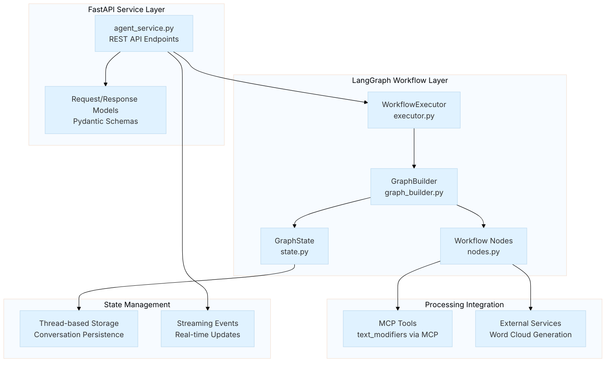
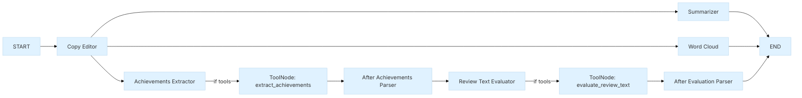
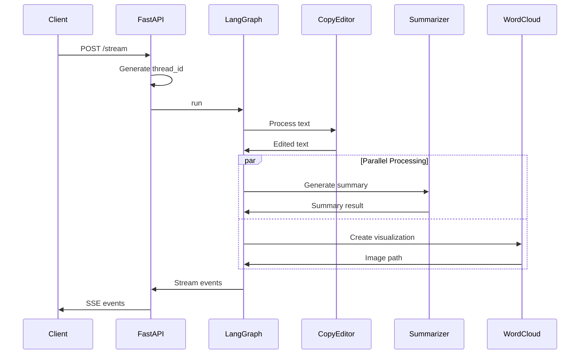

# Agents Package

The `metamorphosis.agents` package includes LangGraph-based agent workflows for multi‑stage text processing. It offers simple synchronous and streaming examples via a small FastAPI service.

## Package Architecture

## Core Components

### 1. FastAPI Service (`agent_service.py`)

The main service provides REST API endpoints for text processing workflows.

### 2. LangGraph Workflow (`self_reviewer/`)

Implements a clear multi-step learning example.

## Module Documentation

### Core Modules

| Module | Description | Key Components |
|--------|-------------|----------------|
| [`self_reviewer/`](self_reviewer/index.md) | LangGraph workflow implementation | Workflow nodes, state management |
| [`WorkflowExecutor`](self_reviewer/WorkflowExecutor.md) | Entry point for running the workflow | initialize, run_workflow |
| [`GraphBuilder`](self_reviewer/GraphBuilder.md) | Graph construction | nodes, edges, memory |
| [`WorkflowNodes`](self_reviewer/WorkflowNodes.md) | Node implementations | copy edit, summarize, word cloud, tools |
| [`MCPClientManager`](self_reviewer/MCPClientManager.md) | MCP client wrapper | get_tool, list_available_tools |
| [`GraphState`](self_reviewer/GraphState.md) | Workflow state | fields and transitions |

## Workflow Architecture

### Processing Flow

---

This package aims for clarity, so newcomers can learn agent workflows step by step.
