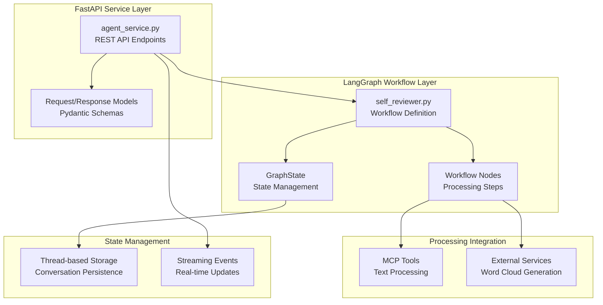
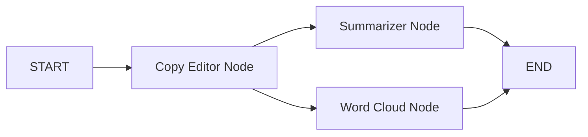
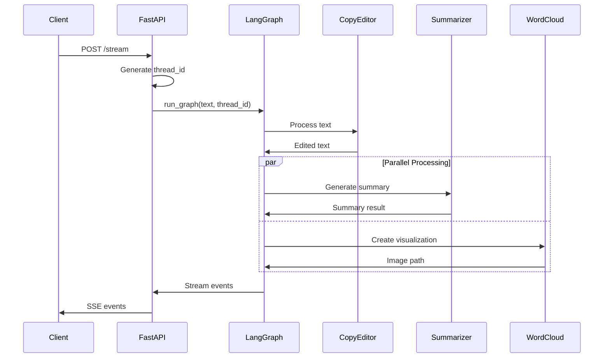
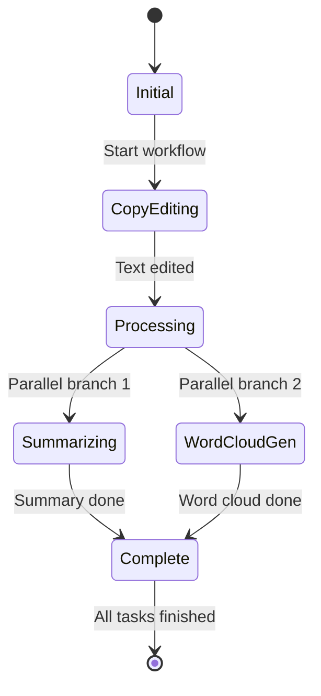

# Agents Package

The `metamorphosis.agents` package implements LangGraph-based agent workflows for orchestrating multi-stage text processing operations. It provides both synchronous and asynchronous processing capabilities through a FastAPI service with real-time streaming support.

## Package Architecture



## Core Components

### 1. FastAPI Service (`agent_service.py`)

The main service provides REST API endpoints for text processing workflows:

#### Endpoints

- **`POST /invoke`**: Synchronous workflow execution
- **`POST /stream`**: Asynchronous streaming workflow execution
- **`GET /docs`**: Interactive API documentation
- **`GET /health`**: Service health check

#### Features

- **CORS Support**: Configurable cross-origin resource sharing
- **Error Handling**: Comprehensive exception management
- **Request Validation**: Pydantic model validation
- **Streaming Support**: Server-Sent Events (SSE) for real-time updates
- **Thread Management**: Unique thread IDs for conversation persistence

### 2. LangGraph Workflow (`self_reviewer.py`)

Implements a sophisticated multi-stage text processing workflow:

#### Workflow Stages



#### Node Implementations

1. **Copy Editor Node**: Text rationalization and improvement
2. **Summarizer Node**: Abstractive summary generation (parallel)
3. **Word Cloud Node**: Visual representation generation (parallel)

### 3. State Management (`GraphState`)

Type-safe state management using TypedDict:

```python
class GraphState(TypedDict):
    review_text: str  # Original input text
    copy_edited_text: str | None  # Processed text
    summary: str | None  # Generated summary
    word_cloud_path: str | None  # Generated visualization path
```

## Module Documentation

### Core Modules

| Module | Description | Key Components |
|--------|-------------|----------------|
| [`agent_service.py`](agent_service.md) | FastAPI REST API service | Endpoints, middleware, error handling |
| [`self_reviewer.py`](self_reviewer.md) | LangGraph workflow implementation | Workflow nodes, state management |
| [`__init__.py`](agents_init.md) | Package initialization | Exports and configuration |

### Key Classes and Functions

| Component | Purpose | Documentation |
|-----------|---------|---------------|
| [`FastAPI App`](agent_service.md#fastapi-app) | Main service application | [View Details →](agent_service.md#fastapi-app) |
| [`GraphState`](self_reviewer.md#graphstate) | Workflow state definition | [View Details →](self_reviewer.md#graphstate) |
| [`build_graph`](self_reviewer.md#build-graph) | Workflow construction | [View Details →](self_reviewer.md#build-graph) |
| [`run_graph`](self_reviewer.md#run-graph) | Workflow execution | [View Details →](self_reviewer.md#run-graph) |

## Workflow Architecture

### Processing Flow



### State Transitions



## API Reference

### Request Models

#### InvokeRequest

```python
class InvokeRequest(BaseModel):
    review_text: str = Field(..., min_length=1)
    thread_id: Optional[str] = Field(None, description="Optional thread ID")
```

#### StreamRequest

```python
class StreamRequest(BaseModel):
    review_text: str = Field(..., min_length=1)
    thread_id: Optional[str] = Field(None, description="Optional thread ID")
    mode: str = Field("values", description="Streaming mode")
```

### Response Models

#### InvokeResponse

```python
class InvokeResponse(BaseModel):
    thread_id: str
    copy_edited_text: str | None
    summary: str | None
    word_cloud_path: str | None
```

## Usage Examples

### Synchronous Processing

```python
import requests

response = requests.post(
    "http://localhost:8001/invoke",
    json={
        "review_text": "I worked on improving system performance this quarter...",
        "thread_id": "user-123"
    }
)

result = response.json()
print(f"Edited text: {result['copy_edited_text']}")
print(f"Summary: {result['summary']}")
print(f"Word cloud: {result['word_cloud_path']}")
```

### Streaming Processing

```python
import requests
import json

def stream_processing(review_text: str):
    response = requests.post(
        "http://localhost:8001/stream",
        json={
            "review_text": review_text,
            "mode": "values"
        },
        stream=True
    )
    
    for line in response.iter_lines():
        if line.startswith(b"data:"):
            data = json.loads(line[5:])  # Remove "data:" prefix
            print(f"Event: {data}")
            
            # Process real-time updates
            if "copy_edited_text" in data:
                print(f"Copy editing complete: {data['copy_edited_text'][:100]}...")
            if "summary" in data:
                print(f"Summary ready: {data['summary']}")
```

### Python Client Integration

```python
from metamorphosis.agents.self_reviewer import run_graph, build_graph

async def process_review(text: str, thread_id: str = "default"):
    graph = await build_graph()
    
    async for event in run_graph(
        graph=graph,
        review_text=text,
        thread_id=thread_id
    ):
        print(f"Processing event: {event}")
        
        # Handle different event types
        if "copy_edited_text" in event:
            # Copy editing completed
            pass
        elif "summary" in event:
            # Summarization completed
            pass
        elif "word_cloud_path" in event:
            # Visualization completed
            pass
```

## Configuration

### FastAPI Service Configuration

```python
app = FastAPI(
    title="LangGraph for FastAPI Service",
    description="A FastAPI service for processing self-review texts",
    version="1.0.0",
    docs_url="/docs",
    redoc_url="/redoc",
)
```

### CORS Configuration

```python
app.add_middleware(
    CORSMiddleware,
    allow_origins=["*"],  # Configure for production
    allow_credentials=True,
    allow_methods=["*"],
    allow_headers=["*"],
)
```

### Environment Variables

```bash
# Service configuration
FASTAPI_HOST=0.0.0.0
FASTAPI_PORT=8001

# OpenAI configuration
OPENAI_API_KEY=sk-...

# Project configuration
PROJECT_ROOT_DIR=/path/to/project
```

## Advanced Features

### Thread-based State Persistence

The service maintains conversation state using unique thread IDs:

```python
def _generate_thread_id(provided_thread_id: str | None) -> str:
    if provided_thread_id and provided_thread_id.strip():
        return provided_thread_id.strip()
    return str(uuid.uuid4())
```

### Error Handling Strategy

Comprehensive error handling with structured responses:

```python
def _create_error_response(error_message: str, status_code: int = 500) -> JSONResponse:
    return JSONResponse(
        status_code=status_code,
        content={
            "error": error_message,
            "timestamp": datetime.utcnow().isoformat(),
            "status": "error"
        }
    )
```

### Streaming Event Generation

Real-time event streaming using Server-Sent Events:

```python
async def _generate_stream_events(
    review_text: str, 
    thread_id: str, 
    mode: str, 
    request: Request
) -> AsyncIterator[bytes]:
    try:
        graph = await build_graph()
        async for event in run_graph(
            graph=graph,
            review_text=review_text,
            thread_id=thread_id
        ):
            # Format and yield SSE event
            yield f"data: {json.dumps(event, default=str)}\n\n".encode("utf-8")
    except Exception as e:
        error_data = {"error": str(e), "status": "error"}
        yield f"data: {json.dumps(error_data)}\n\n".encode("utf-8")
```

## Performance Optimization

### Parallel Processing

The workflow implements parallel execution for independent tasks:

```python
# Copy editing happens first (required for other tasks)
copy_edited_text = await copy_editor_node(state)

# Summarization and word cloud generation run in parallel
await asyncio.gather(
    summarizer_node(state),
    wordcloud_node(state)
)
```

### Resource Management

- **Connection Pooling**: Efficient HTTP connection reuse
- **Memory Management**: Proper cleanup of large processing results
- **Token Optimization**: Efficient prompt design and caching

### Monitoring and Observability

- **Structured Logging**: Comprehensive operation tracking
- **Error Context**: Rich error information for debugging
- **Performance Metrics**: Processing time and resource usage tracking

## Testing

### Unit Tests

```python
import pytest
from metamorphosis.agents.self_reviewer import build_graph, run_graph

@pytest.mark.asyncio
async def test_workflow_construction():
    graph = await build_graph()
    assert graph is not None
    assert hasattr(graph, 'nodes')

@pytest.mark.asyncio
async def test_workflow_execution():
    graph = await build_graph()
    events = []
    
    async for event in run_graph(
        graph=graph,
        review_text="Test review text",
        thread_id="test-123"
    ):
        events.append(event)
    
    assert len(events) > 0
    assert any("copy_edited_text" in event for event in events)
```

### Integration Tests

```python
import requests
import pytest

def test_invoke_endpoint():
    response = requests.post(
        "http://localhost:8001/invoke",
        json={
            "review_text": "Test review for processing",
            "thread_id": "test-thread"
        }
    )
    
    assert response.status_code == 200
    data = response.json()
    assert "copy_edited_text" in data
    assert "summary" in data
    assert "word_cloud_path" in data

def test_streaming_endpoint():
    response = requests.post(
        "http://localhost:8001/stream",
        json={
            "review_text": "Test streaming review",
            "mode": "values"
        },
        stream=True
    )
    
    assert response.status_code == 200
    assert response.headers["content-type"] == "text/plain"
```

## Deployment

### Docker Deployment

```dockerfile
FROM python:3.12-slim

WORKDIR /app
COPY requirements.txt .
RUN pip install -r requirements.txt

COPY src/ ./src/
COPY config.yaml .
COPY prompts/ ./prompts/

CMD ["python", "-m", "metamorphosis.agents.agent_service"]
```

### Production Configuration

```python
# Use production-ready settings
app = FastAPI(
    title="Metamorphosis Agent Service",
    docs_url=None,  # Disable in production
    redoc_url=None,  # Disable in production
)

# Configure CORS for specific origins
app.add_middleware(
    CORSMiddleware,
    allow_origins=["https://your-domain.com"],
    allow_credentials=True,
    allow_methods=["GET", "POST"],
    allow_headers=["*"],
)
```

### Health Monitoring

```python
@app.get("/health")
async def health_check():
    return {
        "status": "healthy",
        "timestamp": datetime.utcnow().isoformat(),
        "version": "1.0.0"
    }
```

## Troubleshooting

### Common Issues

1. **Service Startup Errors**:
   - Check OpenAI API key configuration
   - Verify all dependencies are installed
   - Ensure port availability

2. **Workflow Execution Failures**:
   - Monitor LLM API rate limits
   - Check prompt template availability
   - Verify MCP tools server connectivity

3. **Streaming Issues**:
   - Ensure proper SSE client implementation
   - Check network connectivity and timeouts
   - Monitor memory usage for large texts

### Debug Mode

Enable detailed logging:

```python
import logging
logging.basicConfig(level=logging.DEBUG)

# Run service with debug mode
if __name__ == "__main__":
    uvicorn.run(
        "metamorphosis.agents.agent_service:app",
        host="0.0.0.0",
        port=8001,
        log_level="debug"
    )
```

## See Also

- [MCP Package](../mcp/index.md) - Text processing tools integration
- [UI Package](../ui/index.md) - Streamlit user interface
- [Data Models](../datamodel.md) - Request/response schemas
- [Examples](../../examples/index.md) - Usage examples and tutorials

---

*This documentation is automatically generated from the source code and maintained in sync with the codebase.*
