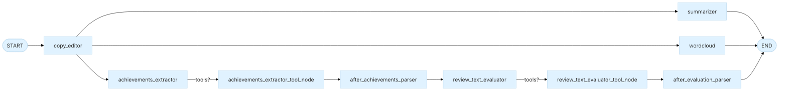

### GraphBuilder

::: metamorphosis.agents.self_reviewer.graph_builder.GraphBuilder

## Purpose

Builds the LangGraph by adding nodes, wiring edges, and enabling a simple in‑memory checkpoint.

## Workflow outline

