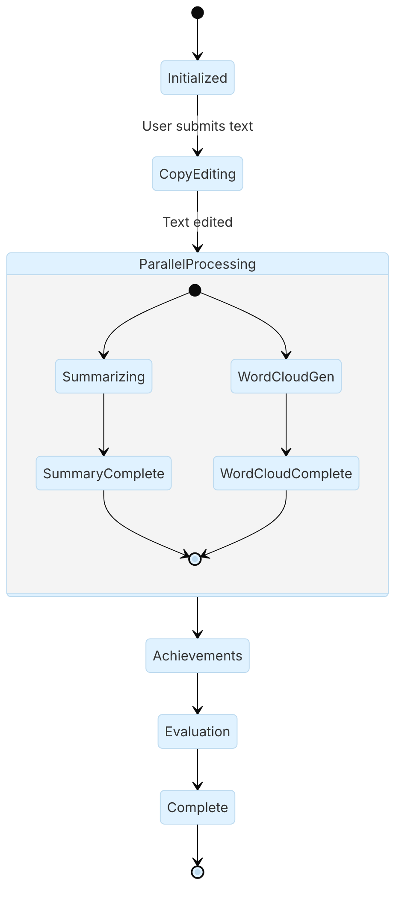

### GraphState

::: metamorphosis.agents.self_reviewer.state.GraphState

## Fields

- `original_text`: input provided by the user
- `copy_edited_text`: improved text from the copy editor
- `summary`: the short summary
- `word_cloud_path`: image path returned by the word cloud tool
- `achievements`: structured achievements list
- `review_scorecard`: structured evaluation
- `messages`: conversation messages for agent/tool steps
- `review_complete`: True when we have enough achievements

## State diagram

