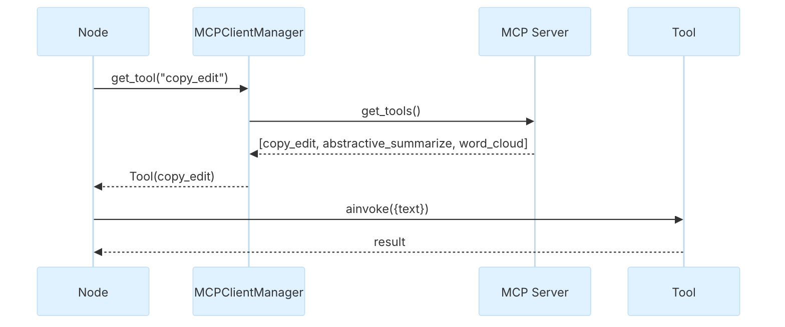

### MCPClientManager

::: metamorphosis.agents.self_reviewer.client.MCPClientManager

## Purpose

Wraps `MultiServerMCPClient` so nodes can look up tools by name and call them.

## Tool lookup flow

