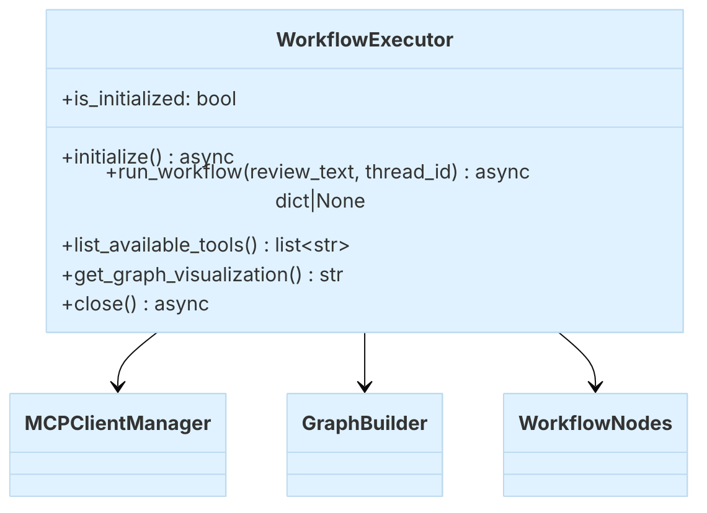

### WorkflowExecutor

::: metamorphosis.agents.self_reviewer.executor.WorkflowExecutor

## What it does

The `WorkflowExecutor` is the friendly entry point. It initializes the MCP client, builds the LangGraph, and runs the workflow for a given piece of text and `thread_id`.

## Typical use

```python
import asyncio
from metamorphosis.agents.self_reviewer import WorkflowExecutor

async def main():
    ex = WorkflowExecutor()
    await ex.initialize()
    result = await ex.run_workflow("Your self‑review text here", thread_id="demo-1")
    print(result)

asyncio.run(main())
```

## Small class diagram




