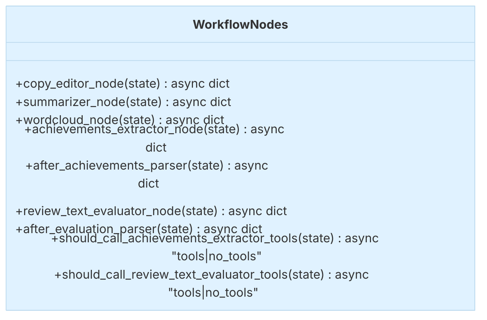

### WorkflowNodes

::: metamorphosis.agents.self_reviewer.nodes.WorkflowNodes

## What each node does

- **copy_editor_node**: calls the `copy_edit` MCP tool to tidy grammar and clarity.
- **summarizer_node**: calls `abstractive_summarize` to produce a short summary.
- **wordcloud_node**: calls `word_cloud` to generate an image path.
- **achievements_extractor_node**: uses an agent with the `extract_achievements` tool.
- **after_achievements_parser**: pulls `AchievementsList` out of the last tool message.
- **review_text_evaluator_node**: uses an agent with `evaluate_review_text`.
- **after_evaluation_parser**: pulls a `ReviewScorecard` from the last tool message.

## Node sketch

