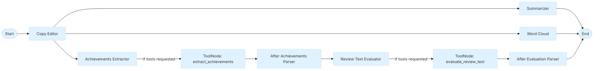

### Self Reviewer Package

The `metamorphosis.agents.self_reviewer` package provides a simple, beginner‑friendly workflow for processing employee self‑reviews. It is built with small, focused classes so you can learn how AI agents and LangGraph fit together without extra complexity.

## How it fits together

```mermaid
%%{init: {'theme': 'base', 'themeVariables': { 'primaryColor': '#e0f2ff', 'edgeLabelBackground':'#ffffffaa', 'clusterBkg':'#f7fbff', 'fontFamily':'Inter'}}}%%
flowchart LR
    subgraph User_Code[Your Code]
        UX[WorkflowExecutor]
    end

    subgraph LangGraph_Workflow[LangGraph Workflow]
        GB[GraphBuilder]
        N[WorkflowNodes]
        S[(GraphState)]
    end

    subgraph Tools[Tools]
        MCP[MCPClientManager]
        RT[review_tools.py\n(extract_achievements, evaluate_review_text)]
    end

    UX --> GB
    GB --> N
    N --> S
    N --> MCP
    N --> RT
```

- **WorkflowExecutor**: The "one object" you use. It initializes everything and runs the workflow.
- **GraphBuilder**: Assembles the LangGraph by adding nodes and edges.
- **WorkflowNodes**: Small functions that do the work (copy‑edit, summarize, word cloud, etc.).
- **GraphState**: The shared state dictionary that flows through the graph.
- **MCPClientManager**: Finds and calls MCP tools (e.g., copy edit, summarize, word cloud).

## Execution flow (at a glance)



## Quick start

```python
import asyncio
from metamorphosis.agents.self_reviewer import WorkflowExecutor

async def main():
    executor = WorkflowExecutor()
    await executor.initialize()
    result = await executor.run_workflow(
        "I improved the data pipeline and reduced costs by 15%.",
        thread_id="demo-1",
    )
    print(result)

asyncio.run(main())
```

## Learn the pieces

- Workflow interface: `WorkflowExecutor` (how you run the graph)
- Graph assembly: `GraphBuilder` (nodes + edges + memory)
- Node logic: `WorkflowNodes` (copy edit, summarize, word cloud, agent/tool steps)
- State model: `GraphState` (what data moves through the graph)
- MCP client: `MCPClientManager` (discovers and calls MCP tools)

See the dedicated pages for details and examples:

- Workflow: `WorkflowExecutor`
- Graph: `GraphBuilder`
- Nodes: `WorkflowNodes`
- State: `GraphState`
- MCP: `MCPClientManager`


