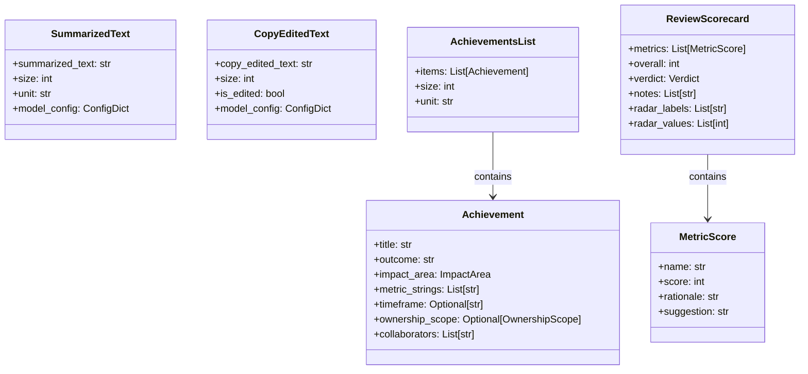
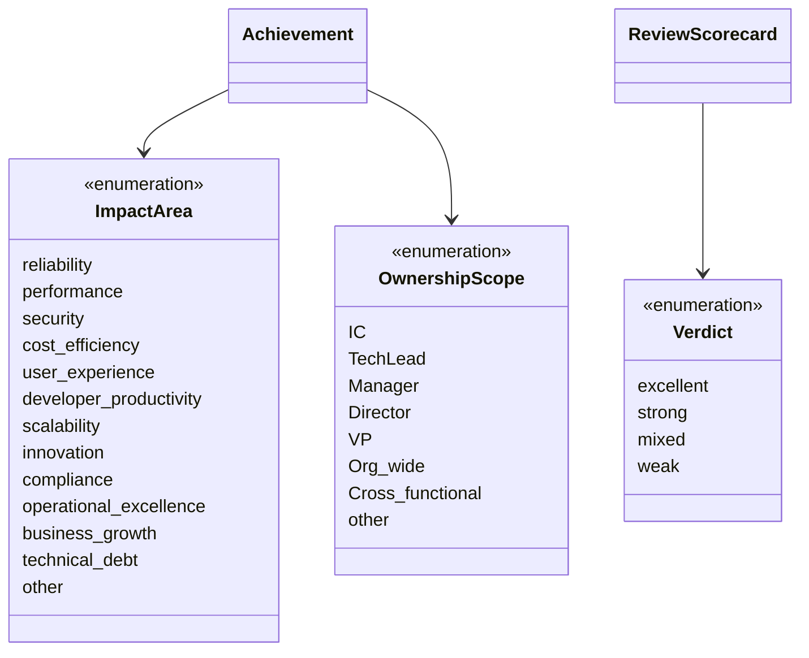

# Data Models

::: metamorphosis.datamodel

## Overview

The `metamorphosis.datamodel` module provides comprehensive Pydantic data models for type-safe handling of text processing inputs, outputs, and workflow state. All models implement strict validation, serialization, and provide rich metadata for debugging and monitoring.

## Core Processing Models

### Text Processing Results



### Enumeration Types



## API Models

### Request Models

#### InvokeRequest
Used for synchronous workflow execution via the `/invoke` endpoint.

#### StreamRequest
Used for asynchronous streaming workflow execution via the `/stream` endpoint.

### Response Models

#### InvokeResponse
Structured response for synchronous processing results.

#### WorkflowState
Internal state management for LangGraph workflows.

## Usage Examples

### Processing Results

```python
from metamorphosis.datamodel import SummarizedText, CopyEditedText

# Create a summary result
summary = SummarizedText(
    summarized_text="Concise summary of the review...",
    size=150,
    unit="tokens"
)

# Create a copy editing result
edited = CopyEditedText(
    copy_edited_text="Professionally edited text...",
    size=500,
    is_edited=True
)

# Access validated data
print(f"Summary: {summary.summarized_text}")
print(f"Tokens: {summary.size} {summary.unit}")
print(f"Was edited: {edited.is_edited}")
```

### Achievement Extraction

```python
from metamorphosis.datamodel import Achievement, AchievementsList, ImpactArea

# Create an achievement
achievement = Achievement(
    title="Reduced checkout latency",
    outcome="Improved p95 latency from 480ms to 190ms through cache optimization",
    impact_area=ImpactArea.performance,
    metric_strings=["480ms", "190ms"],
    timeframe="H1 2025",
    ownership_scope=OwnershipScope.TechLead,
    collaborators=["Payments team", "SRE team"]
)

# Create achievements list
achievements = AchievementsList(
    items=[achievement],
    size=45,
    unit="tokens"
)
```

### Quality Evaluation

```python
from metamorphosis.datamodel import MetricScore, ReviewScorecard, Verdict

# Create metric scores
metrics = [
    MetricScore(
        name="OutcomeOverActivity",
        score=85,
        rationale="Strong focus on concrete outcomes",
        suggestion="Continue emphasizing results"
    ),
    MetricScore(
        name="QuantitativeSpecificity",
        score=90,
        rationale="Excellent use of specific metrics",
        suggestion="Maintain this level of detail"
    )
]

# Create scorecard
scorecard = ReviewScorecard(
    metrics=metrics,
    overall=87,
    verdict=Verdict.excellent,
    notes=["strong_metrics", "clear_outcomes"],
    radar_labels=["OutcomeOverActivity", "QuantitativeSpecificity"],
    radar_values=[85, 90]
)
```

## Validation Features

### Automatic Validation

All models use Pydantic's automatic validation:

```python
from pydantic import ValidationError

try:
    # This will fail validation
    summary = SummarizedText(
        summarized_text="",  # Empty string not allowed
        size=-1,  # Negative size not allowed
        unit=""  # Empty unit not allowed
    )
except ValidationError as e:
    print(f"Validation errors: {e}")
```

### Field Constraints

Models implement comprehensive field constraints:

```python
class Achievement(BaseModel):
    title: str = Field(..., min_length=1, max_length=120)
    outcome: str = Field(..., min_length=1, max_length=400)
    metric_strings: List[str] = Field(default_factory=list)
    # ... additional constraints
```

### Custom Validators

Some models include custom validation logic:

```python
@field_validator("overall")
@classmethod
def validate_overall_score(cls, v: int) -> int:
    if not (0 <= v <= 100):
        raise ValueError("Overall score must be between 0 and 100")
    return v
```

## Serialization

### JSON Serialization

All models support JSON serialization:

```python
# Serialize to JSON
json_data = summary.model_dump()
json_string = summary.model_dump_json()

# Deserialize from JSON
summary_restored = SummarizedText.model_validate(json_data)
summary_from_string = SummarizedText.model_validate_json(json_string)
```

### JSONL Output

Models work seamlessly with JSONL format:

```python
import json

# Write to JSONL
with open("results.jsonl", "w") as f:
    for result in processing_results:
        f.write(result.model_dump_json() + "\n")

# Read from JSONL
results = []
with open("results.jsonl", "r") as f:
    for line in f:
        data = json.loads(line)
        result = SummarizedText.model_validate(data)
        results.append(result)
```

## Configuration

### Model Configuration

All models use strict configuration:

```python
model_config = ConfigDict(
    str_strip_whitespace=True,  # Auto-strip whitespace
    validate_assignment=True,   # Validate on assignment
    extra="forbid",            # Forbid extra fields
    frozen=False               # Allow field modification
)
```

### Field Documentation

Models include comprehensive field documentation:

```python
class SummarizedText(BaseModel):
    summarized_text: str = Field(
        ...,
        description="The generated summary text",
        min_length=1
    )
    size: int = Field(
        ...,
        description="Estimated token count of the summary",
        ge=0
    )
```

## Testing

### Model Validation Tests

```python
import pytest
from metamorphosis.datamodel import SummarizedText

def test_summarized_text_validation():
    # Valid data
    summary = SummarizedText(
        summarized_text="Valid summary",
        size=50,
        unit="tokens"
    )
    assert summary.summarized_text == "Valid summary"
    
    # Invalid data
    with pytest.raises(ValidationError):
        SummarizedText(
            summarized_text="",  # Empty string
            size=50,
            unit="tokens"
        )
```

### Serialization Tests

```python
def test_json_serialization():
    original = SummarizedText(
        summarized_text="Test summary",
        size=25,
        unit="tokens"
    )
    
    # Round-trip serialization
    json_data = original.model_dump()
    restored = SummarizedText.model_validate(json_data)
    
    assert original == restored
```

## Migration Guide

### From v0.x to v1.0

1. **Update import statements**:
   ```python
   # Old
   from metamorphosis.models import Summary, EditResult
   
   # New
   from metamorphosis.datamodel import SummarizedText, CopyEditedText
   ```

2. **Update field names**:
   ```python
   # Old
   result.summary_text
   result.token_count
   
   # New
   result.summarized_text
   result.size
   ```

3. **Handle new validation**:
   ```python
   # Add proper error handling for validation
   try:
       model = SummarizedText(**data)
   except ValidationError as e:
       # Handle validation errors
       pass
   ```

## See Also

- [MCP Package](mcp/index.md) - Text processing utilities that use these models
- [Agents Package](agents/index.md) - Workflow orchestration with state management
- [Examples](../examples/index.md) - Usage examples with real data
- [Pydantic Documentation](https://docs.pydantic.dev/) - Underlying validation framework

---

*This documentation is automatically generated from the source code and maintained in sync with the model definitions.*
