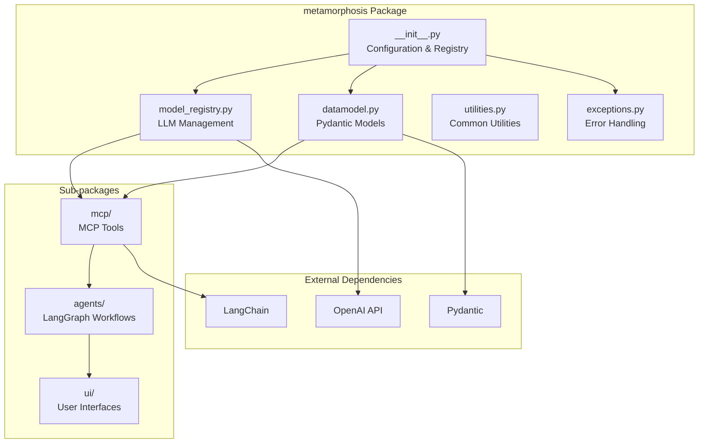

# Metamorphosis Package

The `metamorphosis` package is the core module that provides AI-powered text processing capabilities for employee self-review workflows. It serves as the central orchestration point for LLM-based text utilities, agent workflows, and user interfaces.

## Package Architecture



## Core Components

### Configuration Management

The package provides centralized configuration management through:

- **Environment Variable Loading**: Automatic `.env` file processing
- **YAML Configuration**: Structured configuration via `config.yaml`
- **Model Registry**: Centralized LLM client management
- **Project Root Resolution**: Dynamic project path detection

### Data Models

Comprehensive Pydantic models for type-safe data handling:

- **Processing Results**: Structured outputs for all text processing operations
- **Request/Response Models**: API contract definitions
- **Workflow State**: LangGraph state management schemas
- **Configuration Models**: Type-safe configuration validation

### Error Handling

Robust exception hierarchy with:

- **Specific Error Types**: Granular error classification
- **Context Preservation**: Rich error context for debugging
- **Operation Tracking**: Error source identification
- **Graceful Degradation**: Fallback mechanisms

## Module Documentation

### Core Modules

| Module | Description | Key Components |
|--------|-------------|----------------|
| [`__init__.py`](init.md) | Package initialization and configuration | `_load_config()`, `get_model_registry()` |
| [`datamodel.py`](datamodel.md) | Pydantic data models | `SummarizedText`, `CopyEditedText`, `AchievementsList` |
| [`exceptions.py`](exceptions.md) | Exception hierarchy | `PostconditionError`, `ValidationError`, `MCPToolError` |
| [`utilities.py`](utilities.md) | Common utility functions | `get_project_root()`, `read_text_file()` |
| [`model_registry.py`](model_registry.md) | LLM client management | `ModelRegistry`, `_LLMSettings` |

### Sub-packages

| Package | Purpose | Documentation |
|---------|---------|---------------|
| [`mcp/`](mcp/index.md) | Model Context Protocol integration | [View Details →](mcp/index.md) |
| [`agents/`](agents/index.md) | LangGraph agent workflows | [View Details →](agents/index.md) |
| [`ui/`](ui/index.md) | Streamlit user interfaces | [View Details →](ui/index.md) |

## Usage Patterns

### Basic Initialization

```python
from metamorphosis import get_model_registry
from metamorphosis.mcp.text_modifiers import TextModifiers

# Get configured LLM clients
registry = get_model_registry()

# Initialize text processing utilities
modifiers = TextModifiers()
```

### Configuration Access

```python
from metamorphosis import config

# Access configuration values
openai_key = config.get('openai_api_key')
model_settings = config.get('models', {})
```

### Error Handling

```python
from metamorphosis.exceptions import PostconditionError, ValidationError

try:
    result = modifiers.summarize(text="...")
except ValidationError as e:
    print(f"Validation failed: {e}")
except PostconditionError as e:
    print(f"Processing failed: {e}")
```

## Design Patterns

### Singleton Registry

The `ModelRegistry` implements a singleton pattern to ensure efficient resource usage:

```python
class ModelRegistry:
    _instance = None
    _initialized = False
    
    def __new__(cls):
        if cls._instance is None:
            cls._instance = super().__new__(cls)
        return cls._instance
```

### Factory Pattern

Configuration loading uses a factory pattern with lazy initialization:

```python
def get_model_registry() -> ModelRegistry:
    """Factory function for ModelRegistry singleton."""
    return ModelRegistry()
```

### Validation Decorators

Consistent validation using Pydantic decorators:

```python
@validate_call
def process_text(
    text: Annotated[str, Field(min_length=1)],
    max_words: Annotated[int, Field(gt=0)] = 300
) -> SummarizedText:
    # Implementation with automatic validation
```

## Configuration Schema

### Environment Variables

```yaml
# Required
OPENAI_API_KEY: str  # OpenAI API key
PROJECT_ROOT_DIR: str  # Project root directory

# Optional
MCP_SERVER_HOST: str = "localhost"
MCP_SERVER_PORT: int = 8000
FASTAPI_HOST: str = "0.0.0.0"
FASTAPI_PORT: int = 8001
```

### YAML Configuration

```yaml
models:
  summarizer:
    model: str  # Model name (e.g., "gpt-4o")
    temperature: float  # Sampling temperature
    max_tokens: int  # Maximum output tokens
    timeout: int  # Request timeout in seconds
  
  copy_editor:
    model: str
    temperature: float
    max_tokens: int
    timeout: int
  
  key_achievements:
    model: str
    temperature: float
    max_tokens: int
    timeout: int
  
  review_text_evaluator:
    model: str
    temperature: float
    max_tokens: int
    timeout: int
```

## Performance Considerations

### Resource Management

- **LLM Client Caching**: Singleton registry prevents multiple client instantiation
- **Connection Pooling**: Efficient HTTP connection reuse
- **Memory Management**: Proper cleanup of large text processing results

### Optimization Strategies

- **Lazy Loading**: Configuration and models loaded on-demand
- **Caching**: LRU cache for expensive operations
- **Parallel Processing**: Concurrent execution where possible

## Testing

### Unit Tests

```python
import pytest
from metamorphosis import get_model_registry
from metamorphosis.exceptions import ConfigurationError

def test_model_registry_singleton():
    registry1 = get_model_registry()
    registry2 = get_model_registry()
    assert registry1 is registry2

def test_configuration_validation():
    with pytest.raises(ConfigurationError):
        # Test invalid configuration handling
        pass
```

### Integration Tests

```python
def test_end_to_end_processing():
    modifiers = TextModifiers()
    result = modifiers.summarize(
        text="Sample employee review text...",
        max_words=50
    )
    assert isinstance(result, SummarizedText)
    assert len(result.summarized_text) > 0
```

## Migration Guide

### From v0.x to v1.0

- Update import statements to use absolute imports
- Replace manual configuration with `get_model_registry()`
- Update exception handling to use new hierarchy
- Migrate to new Pydantic v2 models

## Troubleshooting

### Common Issues

1. **Configuration Errors**:
   - Verify `.env` file exists and contains required variables
   - Check `config.yaml` syntax and structure
   - Ensure OpenAI API key is valid

2. **Import Errors**:
   - Verify `PYTHONPATH` includes `src` directory
   - Check for circular import issues
   - Ensure all dependencies are installed

3. **Model Loading Issues**:
   - Verify OpenAI API connectivity
   - Check rate limits and quotas
   - Monitor token usage

### Debug Mode

Enable comprehensive logging:

```python
import logging
from loguru import logger

# Enable debug logging
logger.add("debug.log", level="DEBUG")
logging.basicConfig(level=logging.DEBUG)
```

## See Also

- [MCP Package Documentation](mcp/index.md) - Text processing tools
- [Agents Package Documentation](agents/index.md) - Workflow orchestration
- [UI Package Documentation](ui/index.md) - User interfaces
- [Examples](../examples/index.md) - Usage examples and tutorials

---

*This documentation is automatically generated from the source code and kept in sync with the latest implementation.*