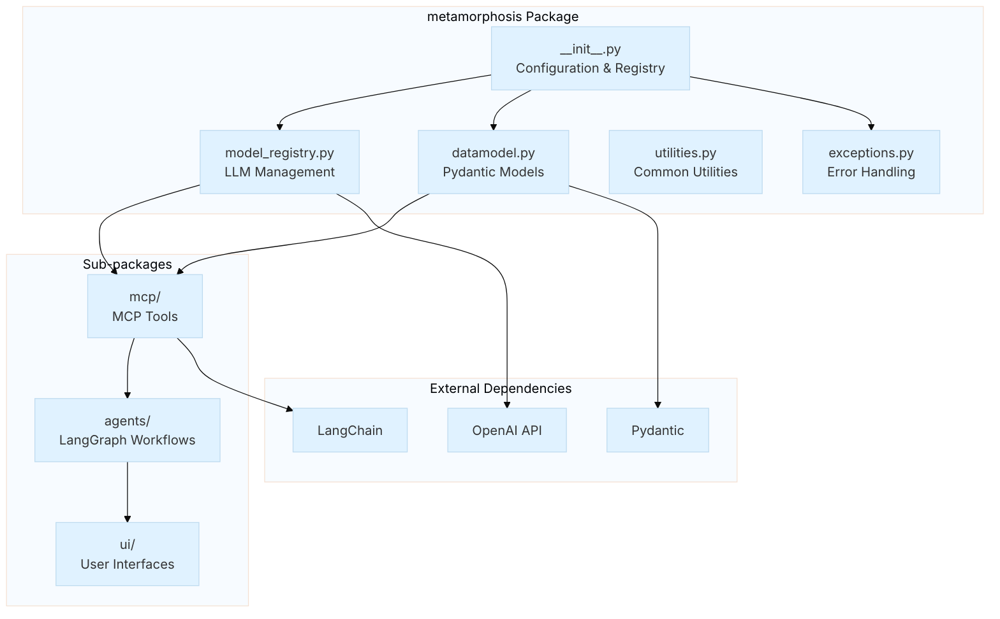

# Metamorphosis Package

The `metamorphosis` package is the core module that provides AI-powered text processing capabilities for employee self-review workflows. It serves as the central orchestration point for LLM-based text utilities, agent workflows, and user interfaces.

## Package Architecture



## Core Components

### Configuration Management

The package provides centralized configuration management through:

- **Environment Variable Loading**: Simple `.env` style via `config.yaml`
- **Model Registry**: Central place to get LLM clients
- **Project Root Resolution**: Utility to resolve paths reliably

### Data Models

Type-safe Pydantic models for data handling:

- **Processing Results**: Structured outputs for text processing
- **Request/Response Models**: API contracts
- **Workflow State**: LangGraph state schemas

### Error Handling

Clear exception types with helpful context. This keeps examples easy to debug and learn from.

## Module Documentation

### Core Modules

| Module | Description | Key Components |
|--------|-------------|----------------|
| [`__init__.py`](init.md) | Package initialization and configuration | `_load_config()`, `get_model_registry()` |
| [`datamodel.py`](datamodel.md) | Pydantic data models | `SummarizedText`, `CopyEditedText`, `AchievementsList` |
| [`exceptions.py`](exceptions.md) | Exception hierarchy | `PostconditionError`, `ValidationError`, `MCPToolError` |
| [`utilities.py`](utilities.md) | Common utility functions | `get_project_root()`, `read_text_file()` |
| [`model_registry.py`](model_registry.md) | LLM client management | `ModelRegistry`, `_LLMSettings` |

### Sub-packages

| Package | Purpose | Documentation |
|---------|---------|---------------|
| [`mcp/`](mcp/index.md) | Model Context Protocol integration | [View Details →](mcp/index.md) |
| [`agents/`](agents/index.md) | LangGraph agent workflows (see `self_reviewer/`) | [View Details →](agents/index.md) |
| [`ui/`](ui/index.md) | Streamlit user interfaces | [View Details →](ui/index.md) |

## Usage Patterns

## Configuration

- Ensure `OPENAI_API_KEY` is set in your environment (or `.env`).
- Project configuration is loaded via `svlearn`'s `ConfigurationMixin`.
- See `config.yaml` for model settings used by `ModelRegistry`.

### Basic Initialization

```python
from metamorphosis import get_model_registry
from metamorphosis.mcp.text_modifiers import TextModifiers

# Get configured LLM clients
registry = get_model_registry()

# Initialize text processing utilities
modifiers = TextModifiers()
```

### Configuration Access

```python
from metamorphosis import config

# Access configuration values
openai_key = config.get('openai_api_key')
model_settings = config.get('models', {})
```

### Error Handling

```python
from metamorphosis.exceptions import PostconditionError, ValidationError

try:
    result = modifiers.summarize(text="...")
except ValidationError as e:
    print(f"Validation failed: {e}")
except PostconditionError as e:
    print(f"Processing failed: {e}")
```

## Design Patterns

### Singleton Registry

The `ModelRegistry` implements a lightweight singleton to keep code simple:

```python
class ModelRegistry:
    _instance = None
    _initialized = False
    
    def __new__(cls):
        if cls._instance is None:
            cls._instance = super().__new__(cls)
        return cls._instance
```

### Validation Decorators

Pydantic `@validate_call` is used for friendly runtime checks in examples:

```python
@validate_call
def process_text(
    text: Annotated[str, Field(min_length=1)],
    max_words: Annotated[int, Field(gt=0)] = 300
) -> SummarizedText:
    # Implementation with automatic validation
```

## Troubleshooting

- Make sure `PYTHONPATH` includes `src` (already set in MkDocs config)
- Check that environment variables like `OPENAI_API_KEY` are available
- Verify dependencies are installed

## See Also

- [MCP Package Documentation](mcp/index.md) - Text processing tools
- [Agents Package Documentation](agents/index.md) - Workflow orchestration (`self_reviewer/`)
- [UI Package Documentation](ui/index.md) - User interfaces
- [Examples](../examples/index.md) - Usage examples and tutorials

---

This project is a learning‑friendly starter for exploring AI agents with LangGraph, MCP tools, and Streamlit. The goal is clarity over complexity.