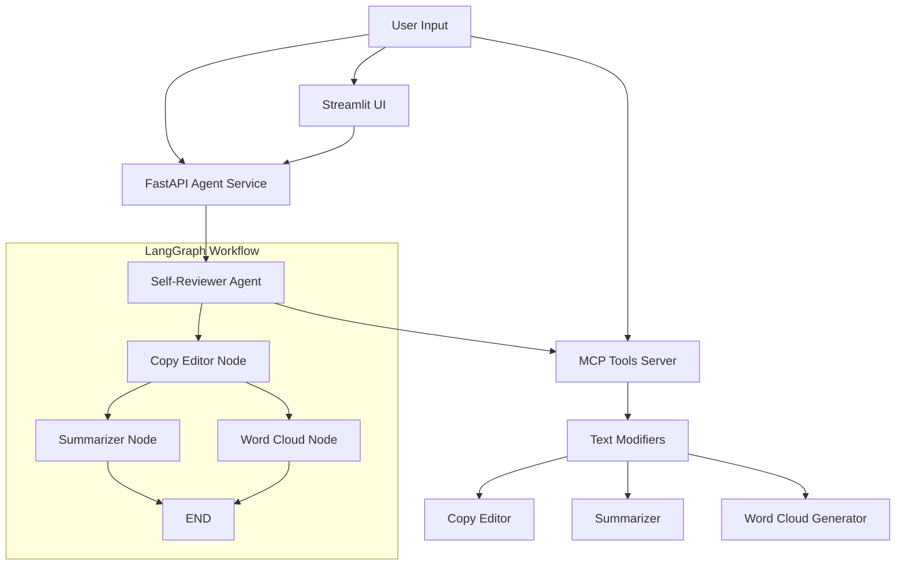

# Metamorphosis Package Overview

The `metamorphosis` package is an AI-powered text processing system that implements intelligent self-review workflows using LangGraph orchestration and MCP (Model Context Protocol) tool integration.

## Package Structure

The metamorphosis package is organized into several specialized modules:

### Core Modules

- **`metamorphosis.mcp`** - Model Context Protocol integration for text processing tools
- **`metamorphosis.agents`** - LangGraph-based agent workflows for self-review processing  
- **`metamorphosis.ui`** - Streamlit-based user interfaces for interactive text processing

## Architecture Overview

## Key Components

### MCP (Model Context Protocol) Integration

The `mcp` package provides text processing capabilities through a standardized protocol:

- **TextModifiers** - Core class for LLM-backed text utilities
- **Tools Server** - MCP server exposing text utilities as callable tools
- **Structured Outputs** - Pydantic models for type-safe results

### Agent Workflows

The `agents` package implements LangGraph-based workflows:

- **Self-Reviewer Agent** - Multi-stage text processing pipeline
- **FastAPI Service** - REST API for synchronous and streaming processing
- **State Management** - Thread-based conversation persistence

### User Interfaces

The `ui` package provides interactive interfaces:

- **Streamlit UI** - Real-time monitoring and control interface
- **SSE Integration** - Server-Sent Events for live updates

## Processing Pipeline

The system implements a three-stage text processing pipeline:

1. **Copy Editing** - Grammar and clarity improvements using LLM
2. **Summarization** - Abstractive summary generation (parallel)
3. **Word Cloud** - Visual representation generation (parallel)

## Configuration

The system uses environment variables for configuration:

- `OPENAI_API_KEY` - Required for LLM operations
- `PROJECT_ROOT_DIR` - Project root directory path
- `MCP_SERVER_HOST/PORT` - MCP server configuration
- `FASTAPI_HOST/PORT` - FastAPI service configuration

## Getting Started

1. Set up environment variables in `.env` file
2. Start the MCP tools server: `python -m metamorphosis.mcp.tools_server`
3. Run the FastAPI service: `python -m metamorphosis.agents.agent_service`
4. Launch the UI: `streamlit run src/metamorphosis/ui/streamlit_ui.py`

## See Also

- [MCP Package Documentation](mcp/index.md)
- [Agents Package Documentation](agents/index.md)
- [UI Package Documentation](ui/index.md)
