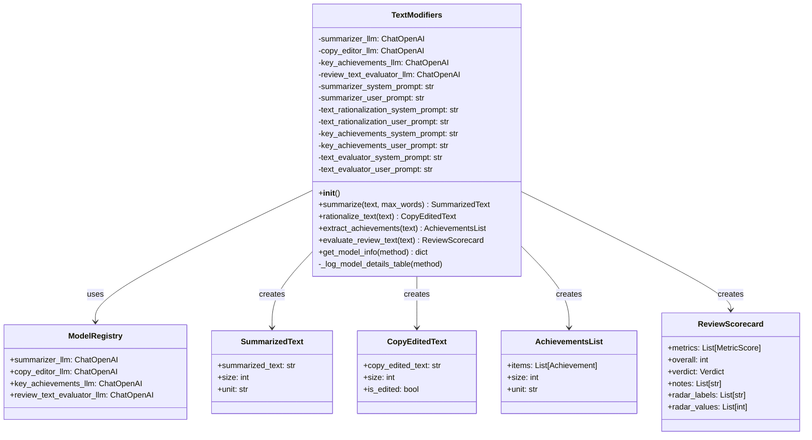

# TextModifiers Class

::: metamorphosis.mcp.text_modifiers.TextModifiers

## Overview

The `TextModifiers` class is the core component of the MCP package, providing comprehensive LLM-backed text processing utilities. It implements four main capabilities: summarization, copy editing (text rationalization), achievement extraction, and review quality evaluation.

## Class Architecture



## Initialization

### Constructor

```python
def __init__(self) -> None:
    """Initialize the TextModifiers with LLM chains and prompt templates."""
```

The constructor performs several key initialization steps:

1. **LLM Client Acquisition**: Retrieves configured LLM clients from the ModelRegistry
2. **Prompt Template Loading**: Loads external prompt templates from the `prompts/` directory
3. **Validation**: Ensures all required components are properly initialized

#### LLM Clients

The class initializes four specialized LLM clients:

- **`summarizer_llm`**: For text summarization (default: gpt-4o)
- **`copy_editor_llm`**: For text rationalization (default: gpt-4o)
- **`key_achievements_llm`**: For achievement extraction (default: gpt-4o)
- **`review_text_evaluator_llm`**: For quality evaluation (default: gpt-5)

#### Prompt Templates

Prompt templates are loaded from external Markdown files for maintainability:

```python
# System and user prompts for each capability
self.summarizer_system_prompt = read_text_file(prompts_dir / "summarizer_system_prompt.md")
self.summarizer_user_prompt = read_text_file(prompts_dir / "summarizer_user_prompt.md")
# ... (similar for other capabilities)
```

## Core Methods

### 1. Text Summarization

```python
@validate_call
def summarize(
    self,
    *,
    text: Annotated[str, Field(min_length=1)],
    max_words: Annotated[int, Field(gt=0)] = 300,
) -> SummarizedText:
```

**Purpose**: Generate abstractive summaries of employee review text.

**Features**:
- Configurable word limits (default: 300 words)
- Preserves key information and context
- Structured output with metadata
- Token estimation for billing/monitoring

**Example Usage**:
```python
modifier = TextModifiers()
result = modifier.summarize(
    text="Long employee review discussing multiple projects and achievements...",
    max_words=100
)
print(f"Summary: {result.summarized_text}")
print(f"Token estimate: {result.size} {result.unit}")
```

**Processing Flow**:
1. Input validation using Pydantic decorators
2. Model details logging for traceability
3. LLM invocation with structured output parsing
4. Post-condition validation
5. Result packaging in `SummarizedText` model

### 2. Text Rationalization (Copy Editing)

```python
@validate_call
def rationalize_text(self, *, text: Annotated[str, Field(min_length=1)]) -> CopyEditedText:
```

**Purpose**: Improve grammar, spelling, and professional tone while preserving meaning.

**Key Features**:
- **Grammar & Spelling**: Fixes errors and typos
- **Professional Tone**: Converts informal language to professional style
- **Structure Preservation**: Maintains original paragraph structure
- **Content Integrity**: No addition or removal of factual content
- **Voice Preservation**: Retains author's perspective (first/third person)

**Transformation Examples**:
- `"teh system"` → `"the system"`
- `"w/ better performance"` → `"with better performance"`
- `"reduced by -38%"` → `"reduced by 38%"`

**Example Usage**:
```python
result = modifier.rationalize_text(
    text="I migrated teh system w/ better performance. Latency dropped by -38%."
)
print(f"Edited: {result.copy_edited_text}")
print(f"Was modified: {result.is_edited}")
```

### 3. Achievement Extraction

```python
@validate_call
def extract_achievements(
    self, *, text: Annotated[str, Field(min_length=1)]
) -> AchievementsList:
```

**Purpose**: Extract and structure key accomplishments from employee reviews.

**Key Features**:
- **Ranking**: Achievements ranked by business impact
- **Structured Metadata**: Impact areas, metrics, timeframes, collaborators
- **Quality Filtering**: Only defensible achievements included
- **Limit**: Up to 10 achievements (configurable in prompt)

**Achievement Structure**:
```python
class Achievement:
    title: str  # Concise outcome-oriented label (≤12 words)
    outcome: str  # Impact/result description (≤40 words)
    impact_area: ImpactArea  # Categorized impact type
    metric_strings: List[str]  # Verbatim numbers from text
    timeframe: Optional[str]  # Explicit time period if stated
    ownership_scope: Optional[OwnershipScope]  # Leadership level
    collaborators: List[str]  # Named people/teams
```

**Example Usage**:
```python
result = modifier.extract_achievements(
    text="I reduced checkout p95 latency from 480ms to 190ms in H1 2025 by redesigning the caching layer with the Payments and SRE teams."
)

for achievement in result.items:
    print(f"Title: {achievement.title}")
    print(f"Impact Area: {achievement.impact_area}")
    print(f"Metrics: {achievement.metric_strings}")
    print(f"Timeframe: {achievement.timeframe}")
    print(f"Collaborators: {achievement.collaborators}")
```

### 4. Review Quality Evaluation

```python
@validate_call
def evaluate_review_text(
    self, *, text: Annotated[str, Field(min_length=1)]
) -> ReviewScorecard:
```

**Purpose**: Assess writing quality across six key dimensions.

**Evaluation Dimensions** (with weights):
1. **OutcomeOverActivity** (25%): Emphasis on concrete outcomes vs. task lists
2. **QuantitativeSpecificity** (25%): Use of metrics, numbers, and baselines
3. **ClarityCoherence** (15%): Logical flow and readability
4. **Conciseness** (15%): Efficient, non-redundant expression
5. **OwnershipLeadership** (10%): Clear ownership and leadership signals
6. **Collaboration** (10%): Evidence of cross-team work

**Scoring System**:
- Each dimension scored 0-100 using anchor levels (20/40/60/80/95)
- Overall score is weighted average
- Verdict classification: excellent (≥85), strong (70-84), mixed (50-69), weak (<50)

**Example Usage**:
```python
result = modifier.evaluate_review_text(
    text="I reduced latency from 480ms to 190ms by optimizing the cache. This improved user experience and reduced server costs by 15%."
)

print(f"Overall Score: {result.overall}/100")
print(f"Verdict: {result.verdict}")

for metric in result.metrics:
    print(f"{metric.name}: {metric.score}/100")
    print(f"Rationale: {metric.rationale}")
    print(f"Suggestion: {metric.suggestion}")
```

## Utility Methods

### Model Information Introspection

```python
def get_model_info(self, method: str) -> dict[str, Any] | None:
```

**Purpose**: Retrieve model configuration for debugging and monitoring.

**Parameters**:
- `method`: The method name ("summarize", "rationalize_text", "extract_achievements", "evaluate_review_text")

**Returns**: Dictionary containing model configuration or None if method not found.

**Example Usage**:
```python
info = modifier.get_model_info("summarize")
print(f"Model: {info['model']}")
print(f"Temperature: {info['temperature']}")
print(f"Max Tokens: {info['max_tokens']}")
print(f"Timeout: {info['timeout']}")
```

### Model Details Logging

```python
def _log_model_details_table(self, method: str) -> None:
```

**Purpose**: Log LLM model details in a formatted table for traceability.

This private method is automatically called by all processing methods to provide detailed logging of the model configuration being used. This is crucial for debugging and monitoring in production environments.

**Example Log Output**:
```
LLM Model Details for 'summarize':
Parameter       | Value
----------------|--------------------
Model           | gpt-4o
Temperature     | 0.0
Max Tokens      | 2000
Timeout         | 120
```

## Design Patterns

### Validation-First Design

All public methods use Pydantic's `@validate_call` decorator for automatic input validation:

```python
@validate_call
def summarize(
    self,
    *,  # Keyword-only arguments for clarity
    text: Annotated[str, Field(min_length=1)],  # Must be non-empty
    max_words: Annotated[int, Field(gt=0)] = 300,  # Must be positive
) -> SummarizedText:
```

### Fail-Fast Error Handling

The class implements comprehensive error handling with specific exception types:

```python
try:
    result = summarizer.invoke({})
except Exception as e:
    logger.error("summarize: LLM invocation failed - {}", str(e))
    raise PostconditionError(
        "Summarization LLM invocation failed",
        operation="summarize_llm_invocation"
    ) from e
```

### Structured Output Pattern

All methods return strongly-typed Pydantic models for type safety:

```python
# Instead of returning raw strings or dictionaries
return SummarizedText(
    summarized_text=processed_text,
    size=token_estimate,
    unit="tokens"
)
```

### Template-Driven Prompting

Prompt templates are externalized for maintainability and version control:

```python
messages = [
    ("system", self.summarizer_system_prompt),
    ("user", self.summarizer_user_prompt.format(review=text)),
]
```

## Error Handling

### Exception Hierarchy

The class raises specific exceptions for different error conditions:

- **`ValidationError`**: Invalid input parameters
- **`PostconditionError`**: LLM invocation or output validation failures
- **`ConfigurationError`**: Missing or invalid configuration
- **`FileOperationError`**: Prompt template loading issues

### Error Context

All exceptions include rich context for debugging:

```python
raise_postcondition_error(
    "Summarization output validation failed",
    context={
        "result_type": type(result).__name__,
        "has_text": bool(getattr(result, 'summarized_text', None))
    },
    operation="summarize_validation"
)
```

## Performance Considerations

### LLM Client Reuse

LLM clients are initialized once and reused across all method calls, avoiding expensive re-initialization.

### Prompt Template Caching

Prompt templates are loaded once during initialization and cached in memory.

### Token Optimization

- Efficient prompt design minimizes token usage
- Structured output reduces parsing overhead
- Streaming support for real-time applications

### Memory Management

- Large text inputs are processed efficiently
- Results include size estimates for monitoring
- Proper cleanup of temporary objects

## Testing

### Unit Tests

```python
import pytest
from metamorphosis.mcp.text_modifiers import TextModifiers
from metamorphosis.datamodel import SummarizedText, CopyEditedText

class TestTextModifiers:
    def setup_method(self):
        self.modifier = TextModifiers()
    
    def test_summarization(self):
        result = self.modifier.summarize(
            text="Long employee review text...",
            max_words=50
        )
        assert isinstance(result, SummarizedText)
        assert len(result.summarized_text) > 0
        assert result.size > 0
    
    def test_copy_editing(self):
        result = self.modifier.rationalize_text(
            text="Text with errers and typos."
        )
        assert isinstance(result, CopyEditedText)
        assert "errors" in result.copy_edited_text.lower()
        assert result.is_edited is True
    
    def test_model_info_retrieval(self):
        info = self.modifier.get_model_info("summarize")
        assert info is not None
        assert "model" in info
        assert "temperature" in info
```

### Integration Tests

```python
def test_end_to_end_processing(self):
    modifier = TextModifiers()
    
    # Test full pipeline
    text = "I led a project that improved system performance by 40%..."
    
    summary = modifier.summarize(text=text, max_words=50)
    edited = modifier.rationalize_text(text=text)
    achievements = modifier.extract_achievements(text=text)
    evaluation = modifier.evaluate_review_text(text=text)
    
    assert all([summary, edited, achievements, evaluation])
```

## Migration Guide

### From v0.x to v1.0

1. **Update Imports**:
   ```python
   # Old
   from metamorphosis.text_utils import TextProcessor
   
   # New
   from metamorphosis.mcp.text_modifiers import TextModifiers
   ```

2. **Update Method Names**:
   ```python
   # Old
   processor.copy_edit(text)
   
   # New
   modifier.rationalize_text(text=text)
   ```

3. **Update Return Types**:
   ```python
   # Old - returned plain strings/dicts
   result = processor.summarize(text)
   summary_text = result["summary"]
   
   # New - returns Pydantic models
   result = modifier.summarize(text=text)
   summary_text = result.summarized_text
   ```

## See Also

- [MCP Package Overview](index.md) - Package architecture and design
- [Tools Server](tools_server.md) - MCP server implementation
- [Data Models](../datamodel.md) - Pydantic model definitions
- [Model Registry](../model_registry.md) - LLM client management
- [Examples](../../examples/index.md) - Usage examples and tutorials

---

*This class documentation is automatically generated from the source code and maintained in sync with the implementation.*
