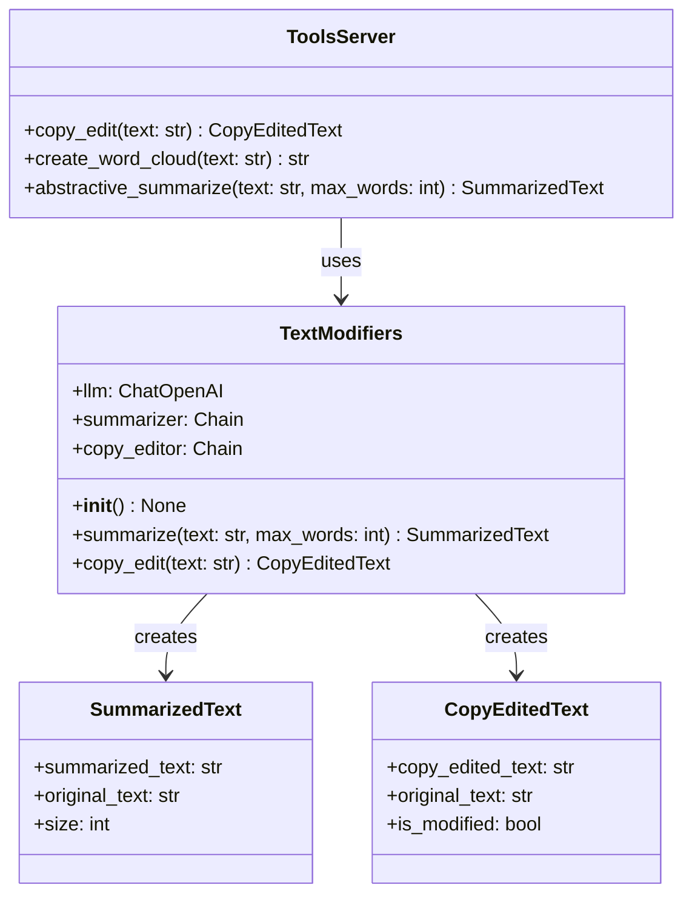

# MCP Package Documentation

The `metamorphosis.mcp` package provides Model Context Protocol (MCP) integration for text processing capabilities. It implements a standardized interface for LLM-backed text utilities with type-safe structured outputs.

## Package Components

### Classes

- **[TextModifiers](TextModifiers.md)** - Core class for LLM-backed text utilities (summarization, copy-editing)
- **[SummarizedText](SummarizedText.md)** - Pydantic model for structured summary outputs  
- **[CopyEditedText](CopyEditedText.md)** - Pydantic model for structured copy-edit outputs

### Functions

- **[get_text_modifiers](get_text_modifiers.md)** - Factory function returning cached TextModifiers instance
- **[copy_edit](copy_edit.md)** - MCP tool function for copy-editing text
- **[create_word_cloud](create_word_cloud.md)** - MCP tool function for generating word clouds
- **[abstractive_summarize](abstractive_summarize.md)** - MCP tool function for text summarization

### Private Utilities

- **[_read_text_file](_read_text_file.md)** - Internal helper for reading prompt template files

## Architecture



## Design Patterns

### Factory Pattern
The `get_text_modifiers()` function implements a factory pattern with LRU caching to ensure efficient reuse of expensive LLM instances.

### Chain of Responsibility
LangChain's chain pattern is used to compose prompt templates with LLM calls and structured output parsing.

### Design by Contract
All public methods use `@validate_call` with `Annotated` types and `Field` constraints for precondition validation, plus O(1) postcondition checks.

## Usage Examples

### Basic Text Processing

```python
from metamorphosis.mcp import get_text_modifiers

# Get cached instance
modifiers = get_text_modifiers()

# Copy edit text
result = modifiers.copy_edit(text="Your review text here")
print(result.copy_edited_text)

# Summarize text  
summary = modifiers.summarize(text="Long review text...", max_words=150)
print(summary.summarized_text)
```

### MCP Tools Integration

```python
from metamorphosis.mcp.tools_server import copy_edit, abstractive_summarize

# Use as MCP tools
edited = copy_edit("Text to improve")
summary = abstractive_summarize("Text to summarize", max_words=200)
```

## Configuration

The package uses environment variables for configuration:

- `OPENAI_API_KEY` - Required for LLM operations
- `PROJECT_ROOT_DIR` - Project root for locating prompt templates
- `MCP_SERVER_HOST/PORT` - Server configuration

## Error Handling

All functions implement fail-fast validation with clear error messages:

- **Preconditions**: Input validation via Pydantic `@validate_call`
- **Postconditions**: Output validation for structured results
- **File Operations**: Proper error handling for missing/empty prompt files

## See Also

- [Tools Server Documentation](tools_server.md)
- [Agent Integration](../agents/index.md)
