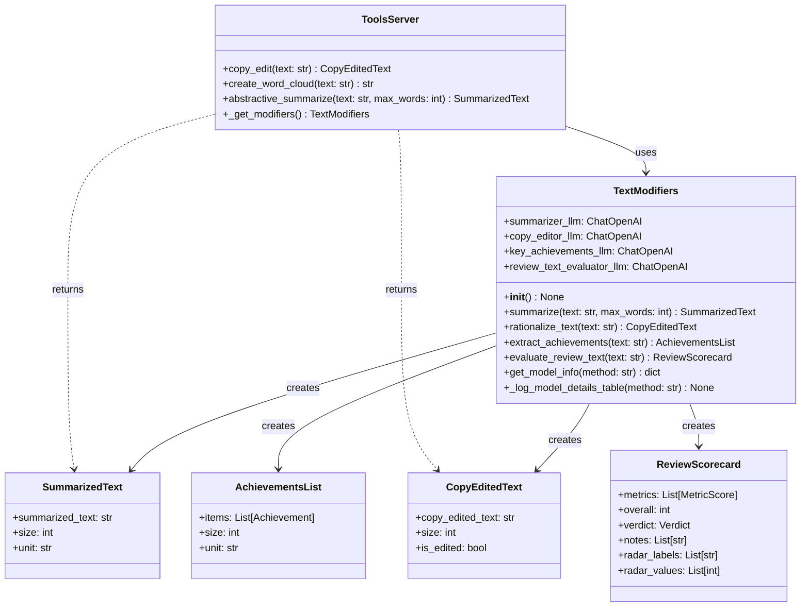
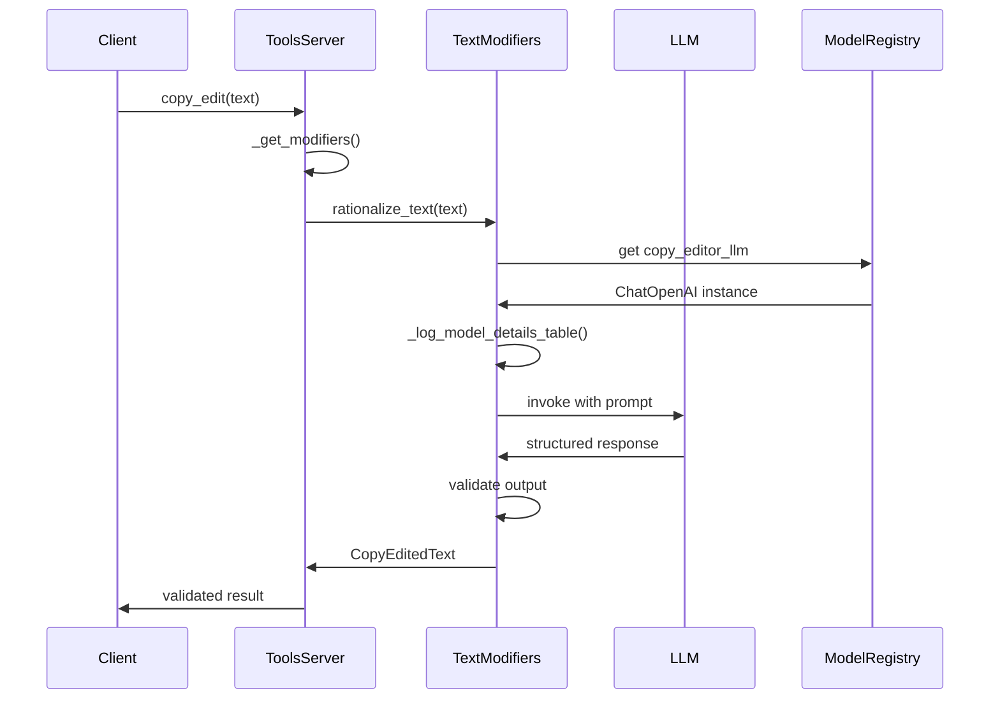
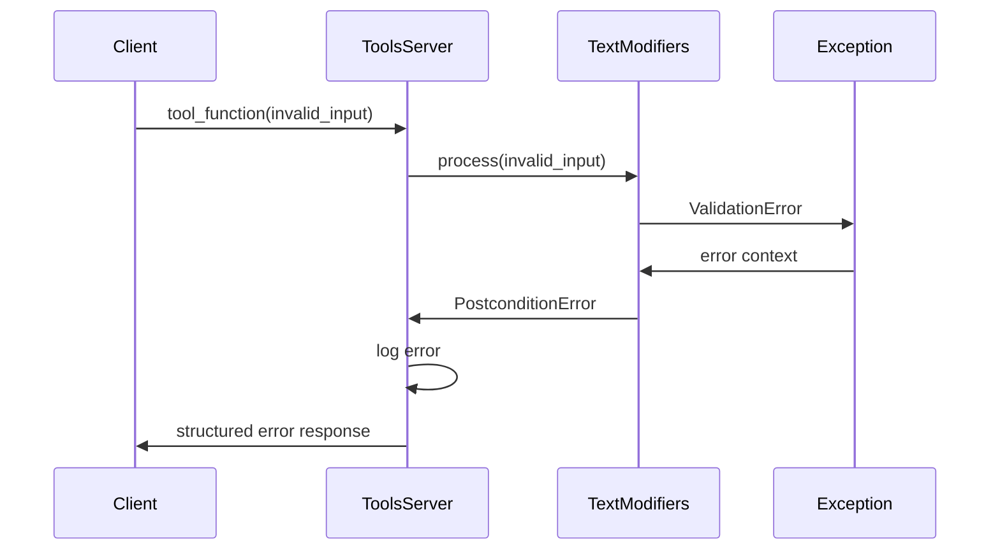

# MCP (Model Context Protocol) Package

The `metamorphosis.mcp` package provides Model Context Protocol integration for text processing capabilities. It implements a standardized interface for LLM-backed text utilities with type-safe structured outputs and comprehensive error handling.

## Package Overview



## Core Components

### TextModifiers Class

The `TextModifiers` class is the heart of the MCP package, providing four main text processing capabilities:

#### 1. Text Summarization
- **Purpose**: Generate abstractive summaries of employee review text
- **Model**: Configurable LLM (default: gpt-4o)
- **Features**: Configurable word limits, structured output, token estimation

#### 2. Text Rationalization (Copy Editing)
- **Purpose**: Improve grammar, spelling, and professional tone
- **Features**: Preserves meaning and structure, tracks modifications
- **Guarantees**: No content addition/removal, maintains author voice

#### 3. Achievement Extraction
- **Purpose**: Extract and structure key accomplishments from reviews
- **Output**: Up to 10 ranked achievements with metadata
- **Metadata**: Impact areas, metrics, timeframes, collaborators

#### 4. Review Quality Evaluation
- **Purpose**: Assess writing quality across six dimensions
- **Scoring**: 0-100 scale with weighted overall score
- **Output**: Detailed metrics, suggestions, radar chart data

### MCP Tools Server

The `tools_server.py` module implements MCP-compliant tool functions that can be called by external agents and workflows:

- **Standardized Interface**: MCP protocol compliance
- **Error Handling**: Comprehensive exception management
- **Caching**: LRU-cached TextModifiers instances
- **Logging**: Detailed operation tracking

## Module Documentation

### Core Modules

| Module | Description | Key Components |
|--------|-------------|----------------|
| [`text_modifiers.py`](TextModifiers.md) | Main text processing class | `TextModifiers` |
| [`tools_server.py`](tools_server.md) | MCP server implementation | Tool functions |
| [`__init__.py`](mcp_init.md) | Package initialization | Exports |

### Key Classes

| Class | Purpose | Documentation |
|-------|---------|---------------|
| [`TextModifiers`](TextModifiers.md) | Core text processing utilities | [View Details →](TextModifiers.md) |

### Tool Functions

| Function | Purpose | Documentation |
|----------|---------|---------------|
| [`copy_edit`](copy_edit.md) | MCP tool for text rationalization | [View Details →](copy_edit.md) |
| [`abstractive_summarize`](abstractive_summarize.md) | MCP tool for summarization | [View Details →](abstractive_summarize.md) |
| [`create_word_cloud`](create_word_cloud.md) | MCP tool for visualization | [View Details →](create_word_cloud.md) |

## Processing Pipeline

### Text Processing Flow



### Error Handling Flow



## Configuration

### Model Configuration

Each processing method uses a dedicated LLM configuration:

```yaml
models:
  summarizer:
    model: "gpt-4o"
    temperature: 0.0
    max_tokens: 2000
    timeout: 120
  
  copy_editor:
    model: "gpt-4o"
    temperature: 0.0
    max_tokens: 4000
    timeout: 180
  
  key_achievements:
    model: "gpt-4o"  # Non-reasoning model for structured output
    temperature: 0.0
    max_tokens: 4000
    timeout: 300
  
  review_text_evaluator:
    model: "gpt-5"  # Reasoning model for complex evaluation
    temperature: 0.0
    max_tokens: 20000
    timeout: 300
```

### Prompt Templates

The system uses external prompt templates for maintainability:

```
prompts/
├── summarizer_system_prompt.md
├── summarizer_user_prompt.md
├── text_rationalization_system_prompt.md
├── text_rationalization_user_prompt.md
├── key_achievements_system_prompt.md
├── key_achievements_user_prompt.md
├── text_evaluator_system_prompt.md
└── text_evaluator_user_prompt.md
```

## Usage Examples

### Basic Text Processing

```python
from metamorphosis.mcp.text_modifiers import TextModifiers

# Initialize the processor
modifier = TextModifiers()

# Summarize text
summary = modifier.summarize(
    text="Long employee review text...",
    max_words=100
)
print(f"Summary: {summary.summarized_text}")
print(f"Size: {summary.size} {summary.unit}")

# Copy edit text
edited = modifier.rationalize_text(
    text="Text with grammar errors and typos..."
)
print(f"Edited: {edited.copy_edited_text}")
print(f"Was modified: {edited.is_edited}")
```

### Achievement Extraction

```python
# Extract achievements
achievements = modifier.extract_achievements(
    text="I led the migration project that reduced latency by 50%..."
)

for achievement in achievements.items:
    print(f"Title: {achievement.title}")
    print(f"Impact: {achievement.impact_area}")
    print(f"Metrics: {achievement.metric_strings}")
    print(f"Timeframe: {achievement.timeframe}")
    print("---")
```

### Quality Evaluation

```python
# Evaluate review quality
scorecard = modifier.evaluate_review_text(
    text="Employee review text to evaluate..."
)

print(f"Overall Score: {scorecard.overall}/100")
print(f"Verdict: {scorecard.verdict}")

for metric in scorecard.metrics:
    print(f"{metric.name}: {metric.score}/100")
    print(f"Rationale: {metric.rationale}")
    print(f"Suggestion: {metric.suggestion}")
    print("---")
```

### MCP Tool Usage

```python
from metamorphosis.mcp.tools_server import copy_edit, abstractive_summarize

# Use MCP tools directly
edited_result = copy_edit("Text to edit...")
summary_result = abstractive_summarize("Text to summarize...", max_words=50)
```

## Advanced Features

### Model Information Introspection

```python
# Get model configuration for debugging
model_info = modifier.get_model_info("summarize")
print(f"Model: {model_info['model']}")
print(f"Temperature: {model_info['temperature']}")
print(f"Max Tokens: {model_info['max_tokens']}")
```

### Custom Prompt Templates

```python
# The system automatically loads prompts from the prompts/ directory
# Modify the .md files to customize behavior
```

### Logging and Debugging

```python
import logging
from loguru import logger

# Enable detailed logging
logger.add("mcp_debug.log", level="DEBUG")

# The system will log:
# - Model configurations
# - Processing steps
# - Token usage
# - Error details
```

## Performance Optimization

### Caching Strategy

- **LLM Client Caching**: Singleton model registry prevents duplicate initialization
- **Prompt Template Caching**: Templates loaded once at startup
- **LRU Cache**: Tools server uses `@lru_cache` for TextModifiers instances

### Token Management

- **Efficient Prompting**: Optimized prompt templates minimize token usage
- **Structured Output**: Direct JSON generation reduces parsing overhead
- **Batch Processing**: Process multiple items efficiently

### Error Recovery

- **Graceful Degradation**: Fallback strategies for API failures
- **Retry Logic**: Automatic retry for transient errors
- **Circuit Breaker**: Prevent cascade failures

## Testing

### Unit Tests

```python
import pytest
from metamorphosis.mcp.text_modifiers import TextModifiers
from metamorphosis.datamodel import SummarizedText

def test_summarization():
    modifier = TextModifiers()
    result = modifier.summarize(
        text="Long text to summarize...",
        max_words=50
    )
    assert isinstance(result, SummarizedText)
    assert len(result.summarized_text) > 0
    assert result.size > 0

def test_copy_editing():
    modifier = TextModifiers()
    result = modifier.rationalize_text(
        text="Text with errers and typos."
    )
    assert isinstance(result, CopyEditedText)
    assert "errors" in result.copy_edited_text.lower()
```

### Integration Tests

```python
def test_mcp_tools_integration():
    from metamorphosis.mcp.tools_server import copy_edit
    
    result = copy_edit("Test text with errors.")
    assert result.copy_edited_text
    assert isinstance(result.is_edited, bool)
```

## Troubleshooting

### Common Issues

1. **LLM API Errors**:
   - Check OpenAI API key validity
   - Monitor rate limits and quotas
   - Verify network connectivity

2. **Prompt Template Issues**:
   - Ensure all prompt files exist in `prompts/` directory
   - Check file encoding (UTF-8)
   - Validate Jinja2 template syntax

3. **Memory Issues**:
   - Monitor token usage with large texts
   - Implement text chunking for very long inputs
   - Use streaming for real-time processing

### Debug Mode

```python
# Enable comprehensive debugging
from metamorphosis.mcp.text_modifiers import TextModifiers
import logging

logging.basicConfig(level=logging.DEBUG)
modifier = TextModifiers()

# All operations will now log detailed information
```

## Migration Guide

### From Legacy Versions

- Update import statements to use new module structure
- Replace manual LLM initialization with ModelRegistry
- Update exception handling for new hierarchy
- Migrate to Pydantic v2 models

## See Also

- [Agents Package](../agents/index.md) - LangGraph workflow integration
- [Data Models](../datamodel.md) - Pydantic schema definitions
- [Examples](../../examples/index.md) - Usage examples and tutorials
- [Model Registry](../model_registry.md) - LLM client management

---

*This documentation is automatically generated from the source code and maintained in sync with the codebase.*