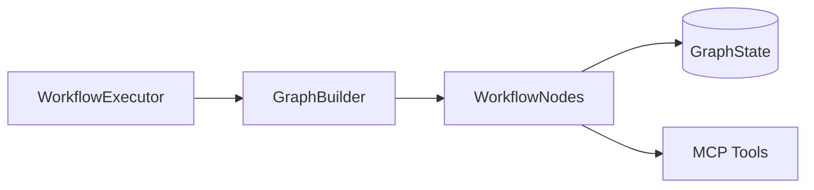
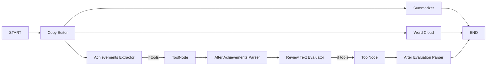

### Slides: Metamorphosis — Learning AI Agents by Building One

> Lightweight slide deck in Markdown (works well with Reveal.js or as handout)

---

## Why agents?
- Small, clear steps
- Compose simple capabilities
- Learn by building

---

## The three moving parts
- Workflow (LangGraph)
- Tools (MCP)
- State (small dict)

---

## The workflow sketch

---

## Demo steps
1. Initialize `WorkflowExecutor`
2. Run workflow on sample text
3. Watch events: copy edit → summary → word cloud
4. Show achievements and evaluation branches

---

## Lessons
- Keep nodes tiny and readable
- Validate inputs/outputs
- Prefer simple branches over clever logic

