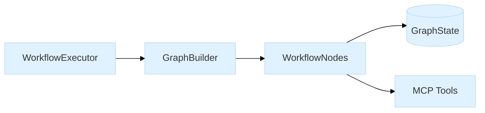
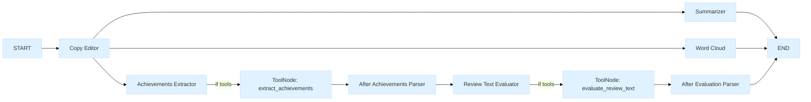

### Talk Outline: Learning AI Agents by Building One

This talk uses the Metamorphosis project as a gentle case study to learn the basics of AI agents, LangGraph, and MCP tools.

## 1) Why agents? (2–3 min)
- **Goal**: Clear steps, small pieces, easy to reason about
- **Idea**: Compose tiny capabilities (copy edit, summarize, visualize) into a simple workflow
- **Takeaway**: Agents are just small programs that cooperate

## 2) The three moving parts (3–4 min)
- **Workflow**: LangGraph nodes and edges
- **Tools**: MCP tools for copy edit, summarize, and word cloud
- **State**: A small dictionary passed between steps

## 3) The workflow in one picture (3–4 min)

## 4) Live demo plan (6–8 min)
- Run `WorkflowExecutor` on a sample review
- Show streaming updates (copy edit → summary → word cloud)
- Show achievements and evaluation branches
- Open the generated word cloud

## 5) Lessons learned (2–3 min)
- Keep nodes small and predictable
- Use state carefully; validate inputs and outputs
- Prefer simple branching over clever logic

## 6) Q&A (2–3 min)
- Share code links and diagrams in the docs
- Invite ideas for next steps (extra nodes, different tools)

